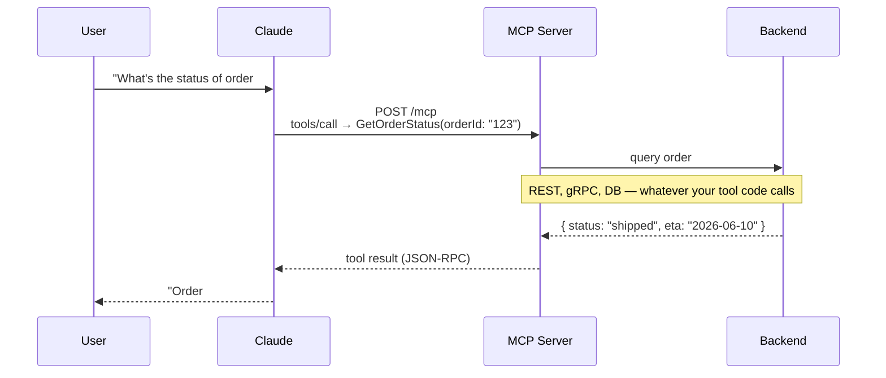

MCP (Model Context Protocol) has quietly become the standard way to wire AI models to external tools and data. It went from 2 million monthly SDK downloads at launch in late 2024 to 97 million by March 2026 — which tells you the ecosystem moved fast. If you're building anything where Claude (or another LLM) needs to talk to your APIs, databases, or services, writing an MCP server is now the cleaner path than duct-taping tool integrations together.

I've been working with MCP in .NET lately and wanted to put together a practical guide — from the core concepts to a working server with auth.

## The Three Primitives

MCP servers expose exactly three types of capabilities:

- **Tools** — Functions the *model* can call. You define the name, description, and a JSON Schema for the inputs. Claude decides when to invoke them based on context. This is what most people mean when they talk about MCP.
- **Resources** — Read-only data identified by URIs. Unlike tools, resources are fetched by the *application*, not the model, and injected into context. Good for docs, config files, database records — anything that's background information rather than an action.
- **Prompts** — Reusable prompt templates your server exposes. Less commonly used, but useful for standardizing complex workflows.

For most integrations, you'll spend 90% of your time on tools.

## Transport: stdio vs. Streamable HTTP

MCP supports two transports, and the right one depends on where your server lives:

| | `stdio` | Streamable HTTP |
|---|---|---|
| **Best for** | Local tools, CLI, Claude Desktop/Code | Remote services, cloud deployments |
| **Latency** | ~1ms | Network-bound |
| **Auth** | N/A (process trust) | OAuth 2.1, bearer tokens, API keys |
| **Setup** | Trivial | Requires HTTP server |

The old SSE transport was deprecated in the June 2025 spec. For anything remote, use Streamable HTTP.

## Building a Minimal MCP Server in .NET

The official C# SDK (`ModelContextProtocol` + `ModelContextProtocol.AspNetCore`) hit v1.0 in February 2026 and integrates cleanly with ASP.NET Core Minimal APIs.

**Install the packages:**

```bash
dotnet add package ModelContextProtocol
dotnet add package ModelContextProtocol.AspNetCore
```

**Define your tools** — any class decorated with `[McpServerToolType]`, methods with `[McpServerTool]`:

```csharp
using ModelContextProtocol.Server;

[McpServerToolType]
public static class OrderTools
{
    [McpServerTool, Description("Look up the current status of an order by ID.")]
    public static object GetOrderStatus(string orderId)
    {
        // Your actual business logic here
        return new { orderId, status = "shipped", eta = "2026-06-10" };
    }
}
```

**Wire it up in `Program.cs`:**

```csharp
var builder = WebApplication.CreateBuilder(args);

builder.Services
    .AddMcpServer()
    .WithHttpTransport()
    .WithToolsFromAssembly();   // scans for [McpServerToolType] in the current assembly

var app = builder.Build();

app.MapMcp("/mcp");  // exposes the MCP endpoint at /mcp

app.Run();
```

That's it. `MapMcp` handles the Streamable HTTP transport — JSON-RPC routing, SSE streaming for long responses, and the MCP handshake. You don't write any of that yourself.

**Adding auth** is standard ASP.NET Core middleware:

```csharp
app.UseAuthentication();
app.UseAuthorization();

app.MapMcp("/mcp").RequireAuthorization();
```

Plug in your existing JWT/OAuth middleware and the MCP endpoint inherits it automatically.

## How This Differs from a Regular REST API

This trips people up. Your MCP server *runs on HTTP*, so what's actually different from a REST API?

| | REST API | MCP Streamable HTTP |
|---|---|---|
| **Protocol** | HTTP verbs + your URL schema | JSON-RPC 2.0 over HTTP POST/GET |
| **Who calls it** | Your client code, curl, browsers | AI models (via MCP clients) |
| **Response style** | Request → response | Can stream back chunks via SSE mid-response |
| **Schema** | OpenAPI / whatever you define | Fixed MCP protocol: `tools/list`, `tools/call`, etc. |
| **Discovery** | External docs / OpenAPI spec | Built-in: client calls `initialize` → gets full tool list |

MCP Streamable HTTP is a **specific protocol layered on HTTP**. The message format (JSON-RPC), the endpoint semantics (`tools/call`, `resources/read`), and the streaming behavior are all defined by the MCP spec. You're not designing the API shape — the spec does that for you. Your job is implementing the tool logic.

When Claude calls `GetOrderStatus`, it's not hitting `GET /orders/{id}`. It's POSTing a JSON-RPC message to `/mcp`:

```json
{
  "method": "tools/call",
  "params": {
    "name": "GetOrderStatus",
    "arguments": { "orderId": "123" }
  }
}
```

The SDK handles all of that translation for you.

Here's the full flow end-to-end:



## Authentication for Remote Servers

Remote MCP servers use OAuth 2.1. Your server acts as an OAuth resource server; the MCP client (Claude Desktop, Claude Code, your app) is the OAuth client.

In practice:

1. Issue access tokens via your existing OAuth provider (Auth0, Keycloak, Entra ID, etc.)
2. Validate `Authorization: Bearer <token>` on incoming requests
3. Scope tokens to specific tools if needed

In .NET, this is just standard `AddAuthentication` / `AddJwtBearer` — the MCP endpoint inherits whatever auth middleware you've configured. For internal tooling, a static API key validated in middleware is the pragmatic shortcut.

## Testing Without an LLM

Don't wire Claude up first. Use the MCP Inspector:

```bash
npx @modelcontextprotocol/inspector
```

It gives you a browser UI to list your server's tools, invoke them with test inputs, and inspect the raw JSON-RPC traffic. This is the fastest feedback loop — no LLM latency, no prompt ambiguity, just your server's actual behavior. For stdio servers, point the inspector at your server process. For HTTP servers, give it the endpoint URL.

## Connecting to Claude

Once your server works in the inspector, wiring it to Claude Desktop or Claude Code is a one-liner config change. For stdio:

```json
{
  "mcpServers": {
    "my-api-server": {
      "command": "dotnet",
      "args": ["run", "--project", "MyMcpServer"]
    }
  }
}
```

For remote HTTP servers, use `"url": "https://your-server.example.com/mcp"` with appropriate auth headers.

## Key Takeaways

- **Tools are the workhorse** — define them with tight JSON schemas and clear descriptions. Claude's routing depends heavily on description quality.
- **Use stdio locally, Streamable HTTP remotely** — don't fight the transport defaults.
- **OAuth 2.1 is the standard for remote servers**, but a bearer token works fine for internal use.
- **Test with MCP Inspector before involving Claude** — faster feedback and exact error messages.
- **The ecosystem is large** — the official `modelcontextprotocol/servers` repo has reference implementations for GitHub, Slack, PostgreSQL, and a dozen others. Worth reading the source before writing your own.

## Further Reading

- [MCP Official Docs](https://docs.claude.com/en/docs/mcp)
- [Build an MCP Server — Official Tutorial](https://modelcontextprotocol.io/docs/develop/build-server)
- [Build a MCP Server in C# — .NET Blog](https://devblogs.microsoft.com/dotnet/build-a-model-context-protocol-mcp-server-in-csharp/)
- [MCP .NET Quickstart — Microsoft Learn](https://learn.microsoft.com/en-us/dotnet/ai/quickstarts/build-mcp-server)
- [MCP C# SDK — GitHub](https://github.com/modelcontextprotocol/csharp-sdk)
- [MCP Reference Servers — GitHub](https://github.com/modelcontextprotocol/servers)
