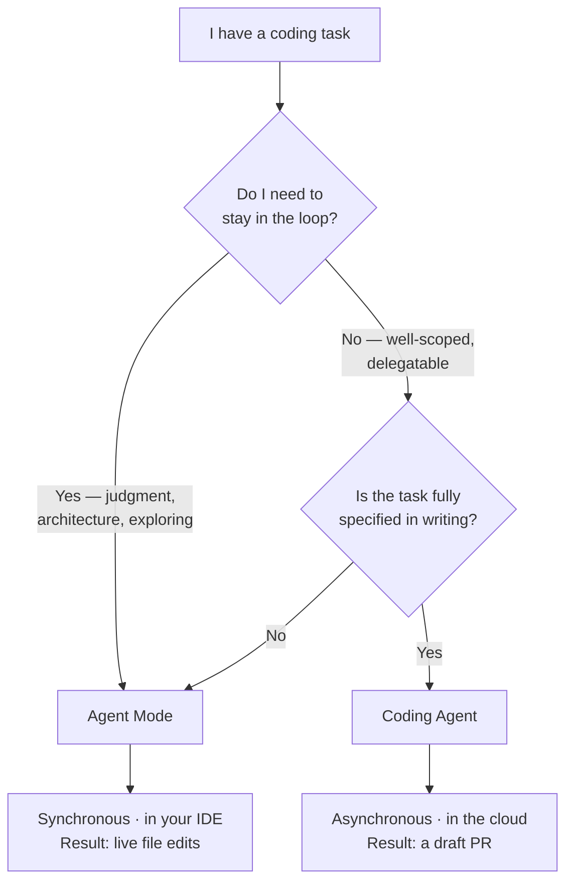
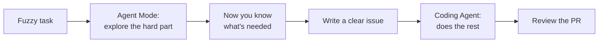

I see a lot of developers fire up Agent Mode for work they could have simply handed off to the cloud—and then they sit there watching a task that never needed them in the first place. Copilot has *two* agentic modes, they look almost the same, and picking the wrong one quietly eats up your hours. Let me break down how to know which one to reach for.

## The Core Distinction

Here's the thing—both modes let Copilot work on its own across multiple files and run terminal commands. So what's the actual difference? It comes down to *where* and *when* they work:

- **Agent Mode** — synchronous, runs inside your IDE, you're watching
- **Coding Agent** — asynchronous, runs in the cloud, you come back to a PR

Neither is strictly "better." They're designed for different parts of a developer's workflow.

## Agent Mode: Your Real-Time Collaborator

Agent mode lives in VS Code's Copilot Chat panel (also available in JetBrains, Visual Studio, and Xcode). Open it with `Ctrl+Alt+I` (Windows/Linux) or `⌃⌘I` (Mac), then switch the mode dropdown from **Ask** or **Edit** to **Agent**.

Once activated, Copilot works in a loop: it edits files, runs commands, reads the output, and keeps going until the task is done or it needs you.

**What it can do in one session:**
- Identify which files need to change and edit them
- Run `npm install`, `pytest`, `cargo build`, etc. in the terminal
- Read test output, diagnose failures, and iterate
- Call MCP tools or Copilot extensions for specialized context

**A real example:** Say you describe a new feature. Agent mode reads your codebase with `@workspace`, makes a plan, touches 6 files, runs the tests, hits a type error, fixes it, and tells you it's done—all while you sit and watch.

The one catch: you have to be present. Agent mode runs in your local dev environment and it pauses the moment something is unclear. And don't worry—it will always ask before doing anything destructive.

## Coding Agent: Assign It Like a Junior Dev

The coding agent operates at the GitHub issue level. You assign an issue to Copilot (from the GitHub UI or Copilot Chat), and it goes to work asynchronously in a GitHub Actions-powered environment—no IDE open required.

**The workflow:**
1. Assign a GitHub issue to Copilot
2. It researches the repo, creates a plan, makes changes on a branch
3. It opens a draft PR with the changes
4. You review, request changes if needed, and merge

This is genuinely useful for:
- Well-scoped bugs with clear acceptance criteria
- Boilerplate-heavy tasks (adding a new API endpoint, writing tests for existing code)
- Tasks you'd delegate to a junior dev—ones where the right answer is knowable, just time-consuming

**What to avoid:** Open-ended architecture decisions, anything that needs business context which isn't in the repo, or tasks where the spec is still vague. The agent only knows what's written in the issue—so garbage in, garbage out. Simple as that.

## Side-by-Side Comparison

| | Agent Mode | Coding Agent |
|---|---|---|
| **Location** | Your IDE (VS Code, JetBrains, etc.) | GitHub Actions (cloud) |
| **Interaction style** | Synchronous, you watch | Asynchronous, you review later |
| **Output** | Direct file edits in local workspace | Pull request on a branch |
| **Best for** | Complex tasks needing your judgment | Well-scoped, delegatable issues |
| **Context source** | Local workspace + `@workspace` | GitHub repo + issue description |
| **Interrupts you?** | Yes, when ambiguous | No—surfaces questions in PR |

## Practical Tips

**For agent mode:**
- Use `@workspace` at the start of complex tasks so Copilot has your full project context before it starts planning
- Be specific about acceptance criteria—"add a dark mode toggle that persists in localStorage" beats "add dark mode"
- Let it run tests; the iterate-on-failure loop is where it earns its keep

**For the coding agent:**
- Write issues like you'd write a ticket for a human: background, expected behavior, acceptance criteria
- Assign straightforward bugs and test-coverage gaps before bigger features
- Review the PR plan (Copilot posts one as a comment) before it opens the full PR—you can redirect early

## The Trick: Use Both, One After the Other

Honestly, don't think of these two as a "vs" at all. The real trick is to use them one after the other.

When a task is still fuzzy, you can't write a good issue yet—and a good issue is exactly what the Coding Agent needs. So do one thing: start in **Agent Mode**. Explore the code, try out the tricky part, and let it show you what the task really involves. Once the hard questions are sorted, whatever is left is the boring, mechanical part—more files, more tests, edge cases. That is the perfect thing to hand off. Now writing a clear issue becomes easy, because you've already figured everything out, and you simply pass it to the Coding Agent.

You spend your attention where judgment matters and hand off the rest.

## A Few Things to Watch Out For

These are the gotchas that nobody tells you about—they only show up once you actually start using both:

- **The Coding Agent can't see your machine.** It runs in the cloud, so it can't reach your local files, your unpushed code, or a database sitting on your office network. If a task needs anything that lives on your laptop, it simply has to be Agent Mode.
- **Things can change while it works.** The Coding Agent starts from a copy of the repo. If someone else touches the same files while it's running, you'll end up with conflicts. So keep the delegated tasks small—that way they finish fast.
- **Handing off work means more PRs to review.** Delegating *feels* free, but trust me, five issues become five pull requests sitting in your queue. The work doesn't vanish—it just shifts from writing to reviewing.
- **Two agents don't talk to each other.** Assign two overlapping tasks and you'll get two PRs that clash. Split the work along clean boundaries, the same way you would for two people who can't see what the other is doing.

Simple rule I follow: treat the Coding Agent like a helpful contractor who only knows what's written in the issue and can't see your screen. So spell everything out.

## Key Takeaways

- Agent mode and the coding agent are complementary, not competing—use both
- Agent mode is for tasks where you want to stay in the loop; the coding agent is for tasks you want off your plate
- The coding agent requires well-written issues to produce useful PRs—quality in, quality out
- Both modes are GA as of early 2026 and require no special flags to enable

## Further Reading

- [Agent mode 101 – The GitHub Blog](https://github.blog/ai-and-ml/github-copilot/agent-mode-101-all-about-github-copilots-powerful-mode/)
- [The difference between coding agent and agent mode – The GitHub Blog](https://github.blog/developer-skills/github/less-todo-more-done-the-difference-between-coding-agent-and-agent-mode-in-github-copilot/)
- [About GitHub Copilot cloud agent – GitHub Docs](https://docs.github.com/copilot/concepts/agents/coding-agent/about-coding-agent)
- [The Coding Harness Behind GitHub Copilot in VS Code – VS Code Blog](https://code.visualstudio.com/blogs/2026/05/15/agent-harnesses-github-copilot-vscode)
- [Introducing Copilot agent mode (original preview post)](https://code.visualstudio.com/blogs/2025/02/24/introducing-copilot-agent-mode)
