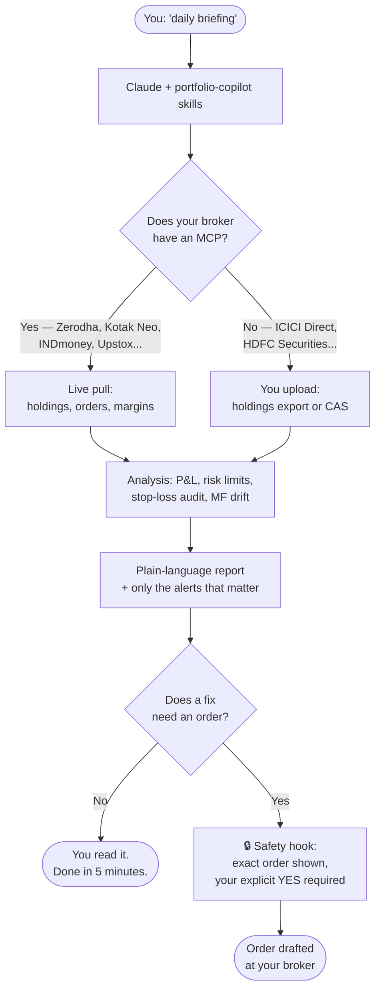

Retail investing in India comes with a part-time job attached: the admin. Stop-loss orders (GTTs) silently get cancelled when a company pays a dividend — leaving positions unprotected with no notification. Mutual fund SIPs pile up over the years until a portfolio holds 13 schemes doing the work of five. And when markets fall 5% in a day, most of us make our worst decisions in our worst state of mind.

I'd been using Claude connected to broker APIs to handle this kind of routine, and the workflows eventually became reliable enough to package. The result is **[portfolio-copilot](https://github.com/arunendapally/portfolio-copilot)** — a free, open-source Claude plugin anyone can install. This post covers what it does, how it's built, and the design decisions that mattered — especially the safety ones.

## What it does

After installing, you say "get started" and the plugin builds your investor profile — your goals, how you'd react to a 20% drop, what you invest monthly. Everything after that is tuned to your risk level. The main commands:

| You say | You get |
|---|---|
| "daily briefing" | 5-minute morning readout: overnight markets, your P&L, alerts |
| "audit GTTs" | Finds unprotected positions, orphan orders, silent cancellations |
| "review my MFs" | Fund-house concentration, SIP quality, drift vs a model portfolio |
| "risk check" | Cash buffer, concentration limits, returns vs your target |
| "crash mode" | A calm, staged playbook when markets fall sharply |
| "analyze RELIANCE" | Fundamentals + technicals assessment for a stock you hold or name |

Here's the whole flow in one picture — including the two ways your data gets in, and the safety gate every order must pass:

## It works with any broker

This was the design constraint I cared most about. Broker connectivity in India is uneven — Zerodha and Kotak Neo have official MCP servers (both bundled with the plugin), INDmoney has one too, and community servers exist for Upstox, Groww, and Angel One. But plenty of investors use ICICI Direct, HDFC Securities, or a bank-linked platform with no AI connectivity at all.

So the plugin has two modes:

**Live mode** — if your broker has an MCP server, the plugin pulls holdings, orders, and margins directly, every session, with fresh data.

**Import mode** — for everyone else, say "import my holdings" and upload what every broker already gives you: a holdings export (CSV/Excel) or a consolidated account statement (CAS) from CAMS/KFintech, which covers all your mutual funds across every platform in one PDF. All the analysis skills work on the imported snapshot, clearly stamped with its as-of date. The only things that need a live connection are order-related — placing GTTs or checking margins.

## The 20-holdings problem

Here's what nobody tells you about long-term investing: the portfolio you'll have in ten years looks nothing like the tidy five-stock plan you started with. You buy a little of something each year. An IPO allotment lands. A bonus issue splits a position in two. A fund you stopped SIPing into still sits there. Cross 20 holdings — and most long-term investors do — and honest monitoring becomes practically impossible by hand. Which of the 25 positions drifted above its weight limit? Which three lost stop-loss protection last quarter? You stop checking, and not-checking is where money quietly leaks.

This is exactly the work worth delegating, because it's repetitive, rule-based, and boring — the opposite of stock-picking. A 25-holding audit takes the plugin the same effort as a 5-holding one.

## Put it on a schedule

The step that changes behavior: don't rely on remembering to ask. If you run the plugin in Claude's Cowork mode (the desktop app), you can schedule the routine — tell Claude:

> "Run my daily briefing every weekday at 9:15 AM, and EOD analysis at 3:45 PM"

Cowork creates scheduled tasks that run those skills automatically and have the results waiting for you. Same for "weekly risk update every Friday afternoon" and "monthly rebalance on the first Friday". Your 25 holdings get audited every single day whether you remember to care or not — and the plugin flags only what needs attention, so a quiet day costs you thirty seconds of reading.

That's the actual answer to portfolio sprawl: not fewer holdings, but monitoring that doesn't depend on your discipline.

## The safety design — this part matters

An AI touching a brokerage account should make you nervous. It made me nervous, and the plugin is built around that nervousness.

**Nothing trades without your confirmation, enforced by code.** The plugin includes a hook that intercepts every order-related tool call — place, modify, or cancel — and blocks it unless the exact order details were shown and you explicitly confirmed that specific order. A vague "yes, fix my stop-losses" doesn't pass. This isn't a polite instruction the AI might forget in a long conversation; it's a gate that runs before the tool executes.

**It never suggests stocks to buy.** This was deliberate. The plugin analyzes what you already hold or explicitly name — it will tell you a holding's fundamentals look weak, but it will not scan the market and tell you what to buy. That line matters both ethically and legally: giving stock tips without SEBI registration is something no plugin should do. There's a full [disclaimer](https://github.com/arunendapally/portfolio-copilot/blob/main/DISCLAIMER.md), and the plugin states it up front during onboarding.

**Setups, not forecasts.** Nobody can predict market direction reliably, so the plugin doesn't try. Morning briefings give you the setup — key levels, catalysts, what happened overnight — and let you judge.

## Don't use Claude? You can still take the skills

Everything in the plugin is plain markdown, MIT-licensed. If you use GitHub Copilot, ChatGPT, or any other assistant, you can copy any skill file into your custom instructions and the workflow logic — the audit steps, the risk thresholds, the output formats — carries over. And since MCP is an open standard, the same broker servers work in other MCP-capable clients like VS Code Copilot, Cursor, and ChatGPT's desktop app.

One honest warning if you do this: the safety hook doesn't come with the markdown. In Claude, "no order without explicit confirmation" is enforced by a gate that runs before any order tool executes. Ported into another assistant, that rule is just text in a prompt — and text can be drifted past in a long conversation. If you connect a live broker elsewhere, you're trading with a written rule instead of an enforced one. Either accept that risk consciously or keep order placement out of the ported setup.

## What building a plugin taught me

A Claude plugin is a folder: skills (markdown files describing workflows), optional agents (autonomous research subagents), optional hooks (event-triggered guards like the order gate above), and optional MCP server configs. The whole plugin is readable markdown and JSON — you can audit every instruction it gives the AI before installing it.

Three lessons from the process:

**E