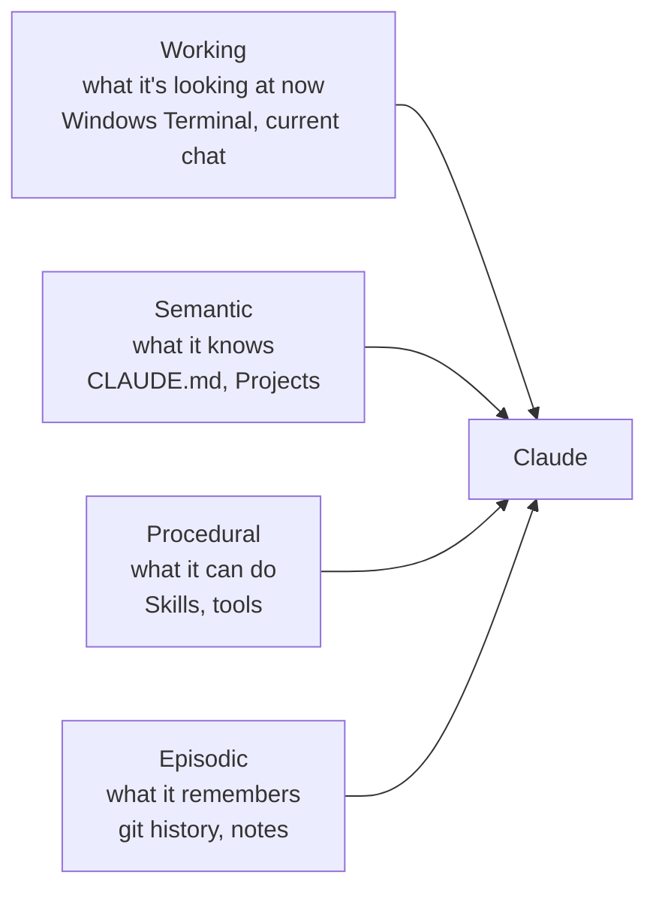

If you use Claude every day, you've probably noticed it behaves differently depending on where you use it. In a fresh chat it starts from nothing. In Claude Code, it seems to "know" your project's conventions. Open a Project and it remembers documents you added weeks ago. That's not the same model behaving inconsistently. It's different **memory** being wired up behind the scenes.

The clearest way I've found to reason about it borrows four categories from how human memory is described. In plain terms, they are what Claude is looking at right now (**working** memory), what it knows (**semantic**), what it can do (**procedural**), and what it remembers doing (**episodic**). Once you can name them, a lot of Claude's behaviour (the good and the frustrating) starts to make sense. For each type I'll cover what it is, how Claude uses it, its trade-offs, and the practices that get the most out of it, across Claude Code, Claude Desktop, and Claude Cowork (Desktop with access to your local files).

## 1. Working memory: what Claude is looking at right now

Working memory is everything Claude can currently see: your recent messages, the files it just read, the system instructions. Think of it as RAM. It's fast and immediately available, but it's **volatile** and **size-limited**. Start a new conversation and it's gone. Cram too much in and Claude starts losing track of instructions you gave it earlier.

This is the same in every Claude surface. In Claude Desktop it's your active chat. In Claude Code it's the current session: the prompt you typed, the diff it's looking at, the error you pasted. When you hit the context limit or start fresh, that memory clears.

The practical lesson for Claude users: working memory is precious, so don't waste it. Pasting an entire codebase or a 40-page PDF into one chat is usually the wrong move. It crowds out the actual task. The other three memory types exist largely to keep this window clear.

Claude Code gives you two commands to manage this window directly:

- **`/clear`** wipes working memory entirely and starts a clean session. Use it when you switch to an unrelated task: the old context is just noise now, and clearing it stops Claude from being distracted by files and decisions that no longer matter.
- **`/compact`** is the smarter option. Instead of throwing everything away, it summarises the conversation so far into a short recap and keeps *that*, freeing up space while preserving the thread. This is distillation in action (the same idea behind episodic memory below), compressing a long session down to the parts worth keeping.

A good habit: `/compact` when you want to keep going on the same task but the window is filling up, and `/clear` when you're genuinely done and moving on.

This matters more than it first sounds, because **irrelevant context doesn't just waste space; it actively degrades answers.** If you finish debugging one feature and then, in the same session, start something unrelated, all that stale detail is still sitting in the window. Claude anchors on it: referencing files that no longer matter, re-applying decisions from the old task, sometimes hallucinating connections that aren't there. This is often called context poisoning, and the fix is simple: **start every new task in a fresh session.** A new terminal tab or window (or a quick `/clear`) is cheaper than fighting a context full of yesterday's problem. Memory is an asset only when it's *relevant*; carried past its usefulness, it becomes noise.

**Strengths:** fastest to access, always current, zero setup. **Limits:** volatile (gone on reset) and hard-capped by the context window, so overfilling it (or polluting it with stale, unrelated context) degrades quality.

## 2. Semantic memory: what Claude knows

Semantic memory is Claude's persistent knowledge base: facts, rules, documentation, preferences that survive across sessions. For most day-to-day use it's just markdown files like `CLAUDE.md`. This is where Claude's surfaces start to diverge, and it's worth knowing which lever you're pulling.

- **In Claude Code**, this is the `CLAUDE.md` file. There isn't just one; Claude reads them at multiple scopes and stacks them together:
  - **User scope:** `~/.claude/CLAUDE.md` (on Windows, `C:\Users\<you>\.claude\CLAUDE.md`). Your personal, global preferences that apply to *every* project.
  - **Project scope:** `CLAUDE.md` at the repo root, checked into git so your whole team shares it.
  - **Folder scope:** you can drop a `CLAUDE.md` inside a subfolder for rules that only apply to that part of the codebase.
- **In Claude Desktop and the web app**, this is **Projects**: the custom instructions and documents you attach to a Project so Claude keeps them in mind as the foundation for every chat inside it.

Because these files stack (and every one of them is re-sent on every turn), **keeping each one short matters a lot.** A lean `CLAUDE.md` with only the rules that earn their place beats a long one that buries the important lines and quietly taxes every message. Put global habits in the user file, project facts in the project file, and resist the urge to write an essay in either.

That raises an obvious question: what about the other docs in your repo, like an `architecture.md` or a `change-log.md`? They're memory too, just a different kind. Your whole repository is a latent knowledge base. The difference is *when* it loads: `CLAUDE.md` is always resident (loaded every turn, costs tokens continuously), while `architecture.md` sits on disk for free and only enters context when Claude actually reads it. So the trick is to keep `CLAUDE.md` as a lean **index that points outward** ("architecture is documented in `architecture.md`; recent changes in `change-log.md`") rather than pasting those files in. The detail stays available at zero standing cost, and loads only when a task needs it, the same `progressive disclosure` principle that keeps skills cheap. (It's worth noting a `change-log.md` is really *episodic* memory, a record of what changed and when, sitting alongside the semantic docs.)

_A Project's semantic memory has three parts: **Instructions**, **Memory**, and **Context** files._

A Project makes this structure explicit by splitting semantic memory into three parts, all visible in the panel above:

- **Instructions:** the standing role and rules ("you are a portfolio monitoring agent connected to..."). This is the *how it should behave* layer.
- **Memory:** a running, evolving note of purpose and context that Claude maintains and timestamps ("last updated Jul 3"). This is the *what it has learned about the work* layer.
- **Context:** the documents you attach (here, `CLAUDE.md`, `RISK_METRICS_ADDON.md`, and a skill file), tracked against a capacity budget. This is the *reference knowledge* layer.

They're three flavours of the same thing (persistent knowledge that carries across every chat in the Project), but keeping them separate is useful: Instructions rarely change, Memory drifts as the work evolves, and Context is where your longer reference files live.

Both `CLAUDE.md` and Projects do the same job: stop Claude from making the same mistake twice. A rule written once into semantic memory is a rule it doesn't forget. If you find yourself giving Claude the same correction repeatedly, that's the signal to move it into a `CLAUDE.md` or Project instruction.

And when semantic memory outgrows files (a whole product manual, thousands of support tickets, more than you'd ever paste in), it moves into a **vector database**, and Claude retrieves only the relevant pieces on demand. That pattern is **RAG** (retrieval-augmented generation), and it's the same principle as everything else here: don't hold it all in context, fetch the slice you need when you need it.

**Strengths:** durable across sessions, cheap to author, kills repeated corrections. **Limits:** it's re-sent on every turn, so it's a standing token cost, and a stale or bloated rule misleads Claude just as reliably as a good one helps. It needs pruning.

## 3. Procedural memory: what Claude can do

Procedural memory is *know-how*: the steps to actually carry out a task, and the ability to take actions rather than just describe them.

This is where Claude Code pulls ahead of the chat interfaces. When Claude Code runs your tests, lints code, or executes a build, it's using tools to *do* things. That's procedural memory in action. It also manages this cleverly through **progressive disclosure**: Claude keeps a lightweight index of its available skills (a folder of `SKILL.md` files, each with a one-line description) and only loads the full instructions for a skill when a task actually triggers it. That keeps the working-memory budget free instead of holding hundreds of instructions it isn't using yet.

Skills aren't the only form of procedural memory. **MCP servers** (Model Context Protocol) extend it further, giving Claude a menu of external tools it can call, like querying a database, hitting an API, or reading from a service. And these follow the same progressive-disclosure economics: in the `/context` shot earlier, 113 MCP tools cost *zero* tokens until one is actually invoked. Procedural memory, in other words, is Claude's toolbox (skills you write plus tools MCP connects), loaded only when reached for.

Plain Claude Desktop chat leans on this least: it's conversational and can't touch your machine. Claude Cowork sits in the middle: it's Desktop, but with access to your local files and folders, so it can actually read and act on them. Claude Code goes furthest, using skills, tools, and the terminal to do autonomous work.

**Strengths:** lets Claude *do* things rather than just describe them, and progressive disclosure keeps it cheap. **Limits:** only as good as the skill definitions; a vague `SKILL.md` fires at the wrong moment or never triggers at all.

## 4. Episodic memory: what Claude remembers doing

Episodic memory is Claude's record of what happened before: past interactions, decisions, and their outcomes. Storing full transcripts of everything quickly becomes unusable, so good systems use **distillation**, compressing an experience down to the lesson worth keeping. Not the whole debugging session, just *"last time this test failed, the cause was a stale cache."*

This is the hardest of the four, and where Claude's behaviour is most indirect. The sharpest example in Claude Code is your **git history**. A commit is a timestamped record of *what changed and why*, exactly the "what happened last time" that defines episodic memory. When Claude reads `git log` to understand why a piece of code was written the way it was, it's recalling an episode, not just reading a fact. (This is worth distinguishing: the current *state* of your files is really semantic memory, what the code *is*. The commit trail is episodic, what was *done*, and the reasoning behind it.) Newer memory features push this further by letting Claude persist a small set of distilled notes across sessions: "last time this test flaked, it was a stale cache." Either way, the goal is the same: build on past work instead of starting from zero each time.

**Strengths:** lets Claude build on the past instead of restarting every session. **Limits:** the weakest of the four today; reconstruction from git or notes is indirect and easy to miss, and nothing persists automatically unless you've set it up (good commit messages, a memory file).

## What each memory costs you

The four types don't just differ in *what* they store. They differ in whether they sit in the context window permanently or get pulled in only when needed. That's what decides their token cost.

| Memory | In Claude Code | Token behaviour | Cost profile |
|---|---|---|---|
| **Working** (what it's looking at now) | The conversation | Grows every turn, as each message, file read, and tool output stacks up | Highest and climbing; this is what fills the window |
| **Semantic** (what it knows) | `CLAUDE.md`, Projects | Loaded once, then re-sent on *every* turn | A fixed tax on every turn; a bloated `CLAUDE.md` costs you all session |
| **Procedural** (what it can do) | Skills (`SKILL.md`) | Only the lightweight index is resident; full instructions load on trigger | Low baseline, spikes only when a skill runs |
| **Episodic** (what it remembers) | Git history, memory notes | Pulled in on demand (`git log`, notes) | Near-zero until accessed, then a one-off spike |

The sneaky one is **semantic memory**. Working memory growth is obvious; you watch the conversation get long. But a 500-line `CLAUDE.md` quietly costs you those tokens on *every single turn* for the whole session. That's the one to keep lean.

Two commands let you actually see and manage this. **`/context`** renders a breakdown of what's occupying the window right now:

_The `/context` view. Notice how the memory types map to categories: **Memory files** (1.6k) is semantic, **Skills** (2.9k for 24 skills) is procedural, and **Messages** (8 tokens, fresh session) is working memory._

This is worth reading closely, because it makes the whole framework tangible:

- **Memory files** (your `CLAUDE.md` files) is your **semantic** footprint. Small here (1.6k), but it's re-sent every turn.
- **Skills** shows procedural memory doing its job: 24 skills cost just 2.9k tokens, because only the lightweight index is loaded, not the full instructions. That's progressive disclosure paying off.
- **Messages** is **working** memory. It's tiny (8 tokens) in a fresh session and grows as you go.
- **MCP tools** are loaded on demand: 113 tools, 0 tokens until one is actually called.

The other lever is **`/memory`**, which opens your `CLAUDE.md` files for viewing and editing. It's not a gauge, it's where you *act*: when `/context` shows memory files eating too much, `/memory` is where you trim them.

_The `/memory` menu: user memory (global preferences) and project memory (`CLAUDE.md` in your repo) are the two semantic-memory files you edit most._

The workflow that follows: run `/context` to find the bloat → if *memory files* are large, `/memory` to trim `CLAUDE.md` → if *messages* are large, `/compact` or `/clear`. (Exact figures and labels shift between Claude Code versions, but the split between memory files, skills, and messages is the part that matters.)

## Which Claude surface uses what

The three ways you're likely to use Claude sit at different points on this spectrum. The bigger the reach into your machine, the more of the memory stack comes into play.

_Claude Cowork is Claude Desktop with a **Cowork** mode (note the Chat/Cowork toggle) that can point at a project or folder on your machine, which is what gives it procedural and episodic reach that plain chat lacks._

| Surface | Working | Semantic | Procedural | Episodic |
|---|---|---|---|---|
| **Claude Desktop** (chat) | Active chat | Projects, custom instructions | Minimal, conversational only | Weak, no view of your local state |
| **Claude Cowork** | Active chat | Projects, custom instructions | Reads and acts on your local files and folders | Can inspect local file state |
| **Claude Code** | Active session | `CLAUDE.md`, Projects | Skills, tools, terminal (full autonomy) | Git history, persisted memory notes |

The pattern: plain Desktop chat is strong on working and semantic memory but can't act or remember past work. Cowork adds local file access, so it gains real procedural and episodic reach. Claude Code uses the whole stack, which is exactly why it's the surface where getting your memory setup right pays off most.

## Best practices

A few habits that follow directly from all of the above:

- **Keep `CLAUDE.md` lean.** It's re-sent every turn, so treat it like a standing bill. Rules only; delete anything stale. Run `/context` occasionally to check its footprint.
- **Promote repeated corrections into semantic memory.** The second time you tell Claude the same thing, put it in `CLAUDE.md` or a Project instruction instead of saying it a third time.
- **One task, one fresh session.** Start each new task in a new terminal tab or window (or `/clear`) so stale context can't poison it. Use `/compact` mid-task when the window fills but you're not done.
- **Don't paste what Claude can fetch.** If it's already in a file or repo, point Claude at it rather than dropping the whole thing into the chat, and let it pull only the parts a task needs.
- **Lean layer resident, detail on demand.** This is *progressive disclosure*, and it's the thread running through everything above: keep what's always loaded (`CLAUDE.md`, skill descriptions) as short as possible, and push the detail into files (reference docs, full `SKILL.md` bodies) that load only when a task pulls them in. It's how Claude Code carries 24 skills and a whole repo at near-zero standing cost.
- **Write focused skills with clear trigger descriptions.** Progressive disclosure only works if the one-line description is a good trigger; that sentence is what decides whether the right skill loads at the right moment.
- **Commit with meaningful messages.** They're Claude's episodic memory in Claude Code: "fixed X because Y" is what it reads back later.
- **Match the surface to the job.** Quick question → Desktop chat. Work on local files → Cowork. Real project work with tools and history → Claude Code.

## The real difference

Most people think a better Claude experience comes from a sharper prompt or a newer model. Usually it's neither. It's memory: the things you tell it once so you never repeat them (semantic), the skills and tools it can use (procedural), the past work it can look back on (episodic), and how clean you keep what it's working on right now (working). Almost all of that is in your hands, and a little effort goes a long way.

It also helps you fix things. Next time Claude frustrates you, trace it to one of the four. It repeated a correction you already gave? That's semantic memory: put it in `CLAUDE.md` or a Project. It lost track of what you said a few messages ago? Its working memory is full: start a fresh chat. It couldn't build on earlier work? That's the limit of episodic memory. Once you know which memory is the problem, "Claude is being dumb" becomes something specific you can fix.

Keep the always-loaded stuff short, let the details load only when needed, and start each new task fresh. Do that, and Claude stops feeling unpredictable and starts feeling like it knows how you work.
