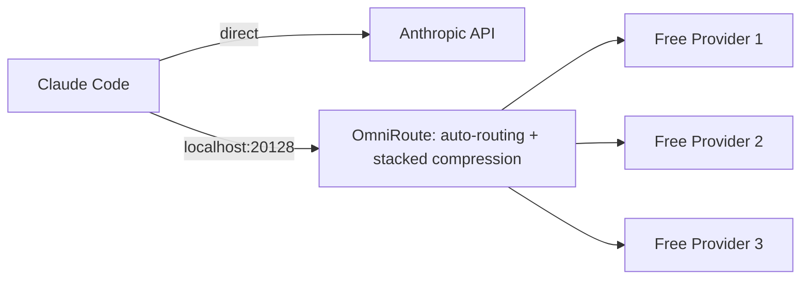

## The token headache we all have

I'm building a couple of side projects at the moment. Not as demos, and not as weekend projects I'll abandon at 80 percent. I want them in production, with real users, built [spec-driven](/posts/spec-driven-development-with-spec-kit/) from the first line. There's no shortage of impressive things built with AI agents, but they mostly stop at the prototype: the demo works, the repo gets stars, and it never has to survive a production deploy, a schema migration, or a bug reported by someone who isn't the author. I want to walk into that gap myself, on projects I care about, and find out exactly where it bites.

Which is when hitting a usage limit stopped being an inconvenience. Claude Desktop and Claude on the go barely dent my usage, but the moment I sit down to actually build with Claude Code, my credits disappear. The official fix is to wait out the reset window, and even that stopped working: I'd wait, get a fresh short-term allowance, burn through that too, and still hit the weekly cap before the week was anywhere near over. So I started rationing. Batching questions. Deciding whether a refactor was worth spending a request on. That's a bad way to run any project, but it's a useless way to run an experiment, because the whole point is to follow the problems where they lead.

So I went looking for something like OpenRouter: a single point where Claude Code could reach more than one model instead of being stuck behind one account's limits. That's how I landed on **OmniRoute**, a local gateway that sits in front of Claude Code, routes each request to whichever free or cheap provider can actually answer it, and compresses what gets sent so there are fewer tokens to burn through in the first place.

The OpenRouter comparison only goes so far, though, and where it breaks is the interesting part:

| | OpenRouter | OmniRoute |
|---|---|---|
| Where it runs | Hosted service, remote servers | A process on your own machine, at `localhost:20128` |
| What you authenticate with | An OpenRouter account and credits | Each provider's own key, stored locally |
| Token compression | None; your context goes as-is | Stacked, before the request leaves your machine |

Both have free models, so this isn't really free versus paid. It's who sits in the middle, and how many tokens you spend getting past them.

Here's what it changes, what the settings actually do, and how I checked that none of it was a toggle quietly doing nothing, because one of them was.

> **TL;DR**
>
> - Claude Code speaks the Anthropic Messages API, so it can be pointed somewhere else. **OmniRoute** is a local gateway that answers that same API and forwards to free or cheap providers.
> - Setup is `npm install -g omniroute`, then `ANTHROPIC_BASE_URL` to `http://localhost:20128` and `ANTHROPIC_MODEL` to `auto/best-free` in `settings.json`.
> - `auto/best-free` is a **virtual model**, resolved per request from the providers you've connected, with a fallback chain and circuit breakers underneath it.
> - Connect your first provider from **Providers → No Auth**, which needs no credentials. NVIDIA NIM is the best free tier I've added since, and it imports 51 free models.
> - **Stacked compression** runs RTK then Caveman: tool output first, prose second, with code, paths and URLs left untouched.
> - Don't trust the dashboard or the CLI on whether it's working. **Read the response headers**: `x-omniroute-decision` and `x-omniroute-compression` tell you what actually happened. I tuned a compression panel for a while with the master switch off.
> - Free tiers are shared, rate-limited capacity. I build on them; **code review still goes to Anthropic**.
{: .prompt-tip }

## What you need to run it

OmniRoute is free and open source, and it runs entirely on your own machine, with no hosted service and no account to create. It's a Node package, so if you have Node and npm you have everything you need:

```bash
npm install -g omniroute
omniroute
```

That's the whole install. Starting it is also the only recurring chore: one terminal window, one command, and it stays up until you shut it down.


Two things about that output. The dashboard is at `http://localhost:20128`, and the first time you open it, the default password is printed for you, so you're not hunting for credentials. And "Server did not respond within 60s" reads alarmingly, but the server output below it shows everything came up fine; on a cold start the readiness check is just slower than the timeout. Open the dashboard before you assume it failed.

Everything in this post is v3.8.49. OmniRoute moves quickly, so if your dashboard doesn't look exactly like these screenshots, that's usually why.

On cost: I haven't paid for anything. The free tiers are genuinely free: no credit card, no trial clock.

## What OmniRoute actually sits between

OmniRoute exposes the Anthropic Messages API, so Claude Code talks to it exactly the way it talks to Anthropic: same protocol, different base URL. It's agent-agnostic, though. [OpenCode](https://opencode.ai/) is the other obvious client, and the gateway doesn't care which one is in front of it. I use Claude Code, so that's what this post covers; OpenCode is on my list to try. Underneath, my install lists 295 providers, 126 of them with free tiers. Two of its features matter here: **auto-routing**, which decides who answers, and **compression**, which shrinks what they read. Both ship on by default in a sensible configuration, and that default is the right starting point. Don't hand-tune this before you've verified the defaults are already doing their job.



The left path is the default: Claude Code talking straight to Anthropic. The right path is what you get once OmniRoute is in the middle, same client, same protocol, a router and a compressor sitting quietly between them.

## Two settings.json files, one decision

The entire difference between "pay per token, one provider" and "route and compress" lives in a single config file.

| | Direct to Anthropic | Through OmniRoute |
|---|---|---|
| `ANTHROPIC_BASE_URL` | unset (default) | `http://localhost:20128` |
| `ANTHROPIC_AUTH_TOKEN` | your real API key | `omniroute` (gateway doesn't check it) |
| `ANTHROPIC_MODEL` | a fixed model name | `auto/best-free` |
| Cost per token | full price | free/cheapest healthy provider |
| Provider lock-in | yes, one vendor | no, resolved per request |

```json
{
  "env": {
    "ANTHROPIC_BASE_URL": "http://localhost:20128",
    "ANTHROPIC_AUTH_TOKEN": "omniroute",
    "ANTHROPIC_MODEL": "auto/best-free",
    "ANTHROPIC_SMALL_FAST_MODEL": "auto/best-free"
  }
}
```

`auto/best-free` is the part worth pausing on. It's a *virtual* model: OmniRoute builds it per request from whatever providers you actually have connected, instead of you pinning one fragile free tier and hoping it's up. The config line never changes as you add providers; the same string just gets more to choose from.

Connecting your first one takes about a minute. Go to **Providers**, filter by **No Auth** (those are the open endpoints that need no credentials at all), and toggle one on. That's how I got started: OpenCode Free, one click, done.


The counter in the corner of that screen reads `1/295`: one provider connected out of 295 available. That was deliberate. Nine of those providers need no credentials at all, and each one is somewhere my code would go. Right now that code is side projects nobody uses yet, so my threat model is low. It won't stay that way: the moment they have real users and their data, "free and no sign-up" is a different conversation, and I'd decide differently again for a client repo. So I started with the one provider I already had a relationship with rather than switching on everything that was free, and added the second deliberately too.

Claude Code itself never finds out any of this is happening. It speaks the Anthropic Messages API to `localhost:20128` the same way it would speak to `api.anthropic.com`.

## The model namespace

Before the routing makes sense, it helps to know that model names here come in three shapes. Hit `/v1/models` on the gateway (it speaks the OpenAI protocol as well as the Anthropic one) and you'll see all of them side by side:

| Shape | Looks like | What it means |
|---|---|---|
| Concrete | `oc/claude-opus-5`, `nvidia/nvidia/nemotron-3-super-120b-a12b` | One specific model on one specific provider. A `-free` suffix marks the free endpoint. |
| Combo | `auto/best-free`, `auto/best-coding`, `auto/coding:cheap` | No fixed model. The router picks from a pool per request, using the criteria in the name. |
| No-think | `no-think/oc/claude-sonnet-5` | The same model with extended thinking disabled, so it's faster and cheaper when you don't need the reasoning. |

The `no-think/` prefix is the one I'd have missed if I hadn't gone looking. A lot of coding work is mechanical, and paying reasoning tokens for a rename is waste.

## Auto-routing: pick a strategy, get fallback for free

The `auto/*` family is bigger than the four you'd guess. Alongside `best-coding`, `best-reasoning`, `best-fast` and `best-free`, there are qualifier forms like `auto/coding:cheap` and `auto/coding:reliable`: same job, different thing to optimize for. What makes the free one usable day to day, rather than a novelty that breaks the first time a provider rate-limits you, is the fallback chain underneath it. If the top pick fails, routing walks down to the next tier, with circuit breakers so a provider that's clearly dead stops getting hammered with retries. This is the exact logic you'd end up writing yourself if you tried to hand-roll multi-provider failover, and it's easy to get subtly wrong when you do.

You don't have to take the dashboard's word for what it decided. Every response comes stamped with the actual decision:

```
x-omniroute-decision: strategy=auto; provider=oc
x-omniroute-response-cost: 0.0000
```

That's routing picking the OpenCode provider and a request that cost nothing. Send your own request and read your own header; the value will tell you which provider you're actually on.

There's one wrinkle when you set `ANTHROPIC_MODEL` to `auto/best-free`. Claude Code doesn't recognize the name (it's OmniRoute's invention, not Anthropic's), so it warns that it will assume a 200k context window and auto-compact against that:


It's a warning, not an error: the session works. But it means Claude Code is guessing at your context window, so if the model behind the route has a bigger one, you're leaving room on the table until you set `CLAUDE_CODE_MAX_CONTEXT_TOKENS` yourself. You can also sidestep it entirely by naming a concrete model with `/model`, which is what I'm doing above.

## Adding NVIDIA NIM

The no-auth providers get you running, but one connection is not much of a routing table. The best free tier I've added since is [NVIDIA NIM](https://build.nvidia.com/): you sign up, generate an API key, and paste it into OmniRoute's provider screen.


**Check** validates the key before you save it, which beats finding out at request time. The toggle worth noticing is **Import only free models**. Leave it on and paid models are skipped entirely, so there's no path by which a stray request quietly costs you money. Given the whole point is to stay inside free tiers, that's the setting I'd want on by default.


Once the key is in, importing the model list pulls in a lot: 51 models, all free.


**Test all models** is the button to press first. The green checks and red warnings in that grid are the result: a model being listed doesn't mean it works through this path, and it's much better to learn that from a test sweep than mid-task. Nemotron 3 Super passed for me, which is why it's the one selected in the Claude Code screenshot above.

Two providers is where auto-routing starts earning its keep: `auto/best-free` now has somewhere to fall back to instead of just failing.

## Stacked compression: RTK then Caveman

Most of what Claude Code sends is code, file paths, and terminal output, and none of that can be compressed the way you'd compress a paragraph of prose. OmniRoute runs two engines back to back:

- **RTK** handles command output: dedupes repetitive tool noise, keeps raw output where it matters.
- **Caveman** handles prose: compresses natural language while leaving code blocks, URLs, file paths, and error lines untouched, byte for byte.

"Stacked" means both run in sequence, so the savings multiply rather than add: `1 - (1 - RTK) * (1 - Caveman)`. On tool-heavy sessions the docs quote 78 to 95 percent token savings. I haven't measured my own ratio, so I can't confirm the number: what I verified is that compression was actually running, using the header further down, and that I stopped running out mid-session.

I turned it on from **Settings → Compression** in the dashboard, picked **Standard Savings** (which maps to the `rtk → caveman` pipeline), and then spent a while tuning something that wasn't running.


Fifty-five filters active, max lines, dedupe threshold, a full filter catalog: the page reads like a control panel that's doing something. It isn't. The master switch is off, and the three counters that would have told me so are sitting at 0 above the fold. I changed the dedupe threshold twice before I read the amber banner. A settings screen that looks alive is more convincing than a counter that says zero, which is worth knowing before you tune anything here.

There's a second version of the same trap. The CLI's `omniroute compression status` can report the panel default even while a different profile is active at runtime. Don't trust that command on its own. Trust the header on a live request instead:

```
x-omniroute-compression: stacked; source=active-profile
```

If it says `stacked`, compression is actually running. If it doesn't, whatever you clicked in the dashboard hasn't taken effect yet, and that's the thread to pull on.

## The "less code" output style

Compression changes what the model reads; output styles change how it writes back. The **Less code** style (I run it at Full) lives in the same Settings → Compression screen and injects a system prefix pushing for minimal diffs: YAGNI, smallest working change, no speculative abstraction. You'll know it's live the same way I did: the model's own reasoning starts echoing the injected phrasing back at you before it answers.

## Prove it in one request

Everything above collapses into a single curl call. Fire it at your own gateway and read the headers on the response:

```bash
curl -s -D- http://localhost:20128/v1/messages \
  -H "Content-Type: application/json" \
  -H "x-api-key: omniroute" \
  -H "anthropic-version: 2023-06-01" \
  -d '{"model":"auto/best-free","max_tokens":50,"messages":[{"role":"user","content":"Say hi"}]}'
```

```
HTTP/1.1 200 OK
x-omniroute-decision: strategy=auto; provider=oc
x-omniroute-compression: stacked; source=active-profile
x-omniroute-response-cost: 0.0000
```

Three headers, one response: routing worked, compression was on, and it cost nothing. If any one of those three is missing on your setup, that's precisely what's broken, and precisely where to look. A compression profile that silently isn't applying is otherwise invisible; you'd never notice from the output alone.

## Where this can bite you

- **Compression touches what the model actually reads.** RTK and Caveman are built to be lossless on code and structured text, but "built to be" isn't the same as "verified for your case." Eyeball one heavy request after turning it on.
- **Free tiers are still shared capacity.** Auto-routing handles failover for you, but you're on the same rate-limited pool as everyone else using that provider's free tier. Fine for building a side project, not something to put on the critical path of a client deliverable, or of anything you're operating in production.
- **The gateway becomes a single point of failure.** Once `ANTHROPIC_BASE_URL` points at localhost, there's no fallback path to Anthropic. If OmniRoute isn't running, Claude Code isn't working, at least until you point the config back at Anthropic. That's a fair trade for a hobby setup, but it's a new dependency you didn't have before, and it's the reason starting it is the first thing I do.
- **Variable quality is invisible from the inside.** The whole point of `auto/*` is that you don't pick the model, which also means a bad answer and a weaker model in the pool look identical. Before you conclude the agent has lost the plot on some problem, check the decision header and see who actually answered.
- **Privacy is a routing question now, not a vendor question.** Your prompts include your code, and with a combo model they go wherever the router sent them that request. Worth noting that `CLAUDE_CODE_DISABLE_NONESSENTIAL_TRAFFIC=1` doesn't help here; that governs telemetry, not where your inference goes.
- **The dashboard is the only door for some settings.** Compression profiles and output styles reject CLI tokens by design, so you'll be doing this part in the browser. That's a deliberate boundary, not a gap they forgot to close.

## What I still send to Anthropic

I haven't moved everything across. OmniRoute handles the building: writing code, iterating, the work that burns through tokens fastest. Code review still goes to Claude Code on my Anthropic account, because a review is where a weaker model costs me the most, and it's a small enough slice of my usage that paying for it isn't what was draining the budget. That split is also why two free providers have been enough so far: the requests I care most about aren't going through them.

I'm still early with this. Combos, quota sharing, the other compression engines, OpenCode as a client instead of Claude Code, all still unexplored. What I have is enough to build without watching a counter, which was the whole problem.

The gateway does the two things that are genuinely tedious to do by hand: deciding, request by request, which free provider is actually up right now, and compressing a context that's mostly code without quietly breaking it.

What changed for me is smaller than that, and I didn't expect it: I stopped rationing. I no longer sit there working out whether a refactor is worth a request. The free models are a step down and I'm not going to pretend otherwise, but the ceiling I kept hitting wasn't the model's quality. It was running out mid-thought.

All of which is still a long way from production. I don't know yet where the real breakage will show up. My guess is somewhere unglamorous like migrations or auth, but a guess is all it is. That's the point of building these rather than arguing about them. Whatever I find, at least it'll be the projects' limits I ran into and not my own quota. I'll write up what breaks.
