Every guide says the same things. Write a CLAUDE.md. Use plan mode. Build skills. Pick the right model. Write better prompts.

My reaction to each one was: do I actually need that, and if so, when?

Here is where I landed after pushing back on each.

> **TL;DR**
>
> - **CLAUDE.md holds facts, the prompt holds today's task.** The file stops mistakes you never thought to prevent, and it survives the context squeeze that eats typed instructions.
> - **A smarter model does not make the file pointless.** Cut the lines about *how to behave*, keep the ones about *your project*. A strong model follows junk more faithfully, not less.
> - **Skip `/plan` when you can already picture the whole change.** Use it when you cannot see which files are involved, and run `/model opusplan` so Opus does the thinking and Sonnet does the typing.
> - **Run `/init`, then delete most of it.** Aim for twenty to fifty lines, and let it grow one line at a time whenever Claude gets something wrong.
> - **Checklists belong in skills, not linked from CLAUDE.md.** CLAUDE.md is for what is true always; a skill is for what is true sometimes.
> - **It does what you said, not what you meant.** Most of the bugs trace back to a decision you handed over without noticing. Review its code like you would your own, because you probably do not.
{: .prompt-tip }

```mermaid
flowchart TD
    A["CLAUDE.md<br>facts only, 20 to 50 lines<br>loaded every task"] --> P
    B["Skills<br>checklists and procedures<br>loaded only when they match"] --> P
    P["One task, one scenario<br>say what done looks like"] --> D{"Can you picture<br>the whole change?"}
    D -->|Yes| E["Just ask<br>small model for mechanical work"]
    D -->|No| F["/plan first<br>/model opusplan"]
    E --> R["Review it like code<br>you wrote yourself"]
    F --> R
```

_The whole post in one picture: what loads always, what loads on demand, and what you decide per task._

## 1. Why write a CLAUDE.md when I can just type it in the prompt?

**The problem.** You open a project. You want Claude to know how things work here. Two places to put that: in your message, or in a file called CLAUDE.md that gets loaded every time.

**The confusion.** Typing it in the prompt clearly works. So the file feels like extra work for no gain.

**What to do.** Put facts about the project in the file. Put what you want done today in the prompt.

**Why.** Three things you lose if you skip the file.

You retype the same lines every session. Your project uses pnpm, not npm. You will type that a hundred times.

Long sessions get squeezed. When the conversation gets too big, older parts get summarized. Your carefully typed instructions can get lost in that. The file does not.

But the big one is this. The file stops mistakes you never thought to prevent. You cannot type an instruction for a problem you did not see coming.

**Example.** You never mention your package manager, because why would you. Claude runs `npm install`. Now you have a broken lockfile and a confused twenty minutes. One line in CLAUDE.md ("use pnpm, never npm") and that never happens, in any session, forever.

## 2. But a smart model like Opus does not need this, right?

**The problem.** Better models need less hand-holding. So does a strong model make CLAUDE.md pointless?

**The confusion.** People treat "instructions" as one thing. It is really two things, and they behave differently.

**What to do.** Cut the instructions that tell the model *how to behave*. Keep the ones that tell it *facts about your project*.

**Why.** Lines like "explain your reasoning" or "do not over-engineer" are mostly there to keep a weaker model on track. A stronger model already does this. Drop them.

But no model, however good, can guess that your `utils` folder is the old one nobody uses. That is not intelligence. That is just something only you know. A smarter model with the wrong facts makes a very confident mistake, faster.

There is a twist too. A strong model follows your file *more* carefully. So junk in the file hurts more, not less.

**Example.** You wrote "always add comprehensive tests" as filler. A weak model half ignores it. Opus takes you seriously and writes a test suite for your one-line typo fix. You did not want that. You just typed it without thinking.

## 3. Do I need a `/plan` for a small change?

**The problem.** `/plan` makes Claude write out what it will do before it touches anything. It costs a round trip.

**The confusion.** The advice says "always plan." That feels wasteful when you already know the answer.

**What to do.** Skip the plan if you can picture the whole change in your head. Use it when you cannot.

**Why.** Planning is for finding out what you do not know: which files are involved, what else breaks. If you already know, you are paying for an answer you have.

**When you do plan, plan with Opus and build with Sonnet.** `/model opusplan` runs plan mode on Opus, then switches to Sonnet for the execution. You do not swap anything by hand. Judgement is what planning needs, and execution is what burns most of the tokens, so the expensive model only runs where it earns its keep. That is a real saving, but it does not make a plan worth having on a one-line fix. For the small change in the heading, the money you save is the plan you skipped.

**Example.** Fixing a typo in one file? Just ask. "Add rate limiting to the API"? You have no idea how many files that touches. Plan that one.

## 4. `/init` writes a huge CLAUDE.md. Should I write it by hand instead?

**The problem.** `/init` reads your project and generates a CLAUDE.md. It comes out long and full of obvious stuff.

**The confusion.** Long file feels thorough. It is not. Every line sits in context on every single task, competing for attention.

**What to do.** Run `/init`, then delete most of it. Aim for twenty to fifty lines.

Cut anything Claude can look up itself: it can read your package.json, it does not need a list of your dependencies. Cut generic advice like "write clean code." Cut rules nobody actually follows.

Keep only what is surprising or expensive to get wrong.

**Why.** A short file gets followed. A long file becomes noise, and the one line that mattered gets lost in it.

Then let it grow slowly. Every time Claude gets something wrong, add one line. Those lines earned their place. The generated ones did not.

**Example.** Delete "this project uses React and TypeScript." Claude can see that. Keep "run `make dev`; `npm run dev` looks like it works but skips the proxy setup." That one saves you an hour.

## 5. Why make a skill? Can I not just link a file from CLAUDE.md?

**The problem.** You have a deploy checklist. A code review checklist. A release process. Where do they go?

**The confusion.** You can link files from CLAUDE.md, so it feels like the obvious place.

**What to do.** Make each one a skill instead.

**Why.** CLAUDE.md loads on every task. Link five checklists and Claude carries all five while you fix a typo. A skill sits there as one line of description and only opens up when the work matches it.

That is the whole idea behind the word "progressive disclosure," which sounds fancier than it is. Load it when you need it, not before.

**Example.** Your deploy checklist stays quiet all week. You say something about shipping, it loads, you get the full checklist. Monday's typo fix never pays for it.

CLAUDE.md is for what is true always. A skill is for what is true sometimes.

## 6. What did I ask, and what did it do? Why is this wasting my time and tokens?

**The problem.** You ask for one thing and get something sideways. Some days it saves you an afternoon, other days you spend that afternoon undoing what it wrote, paying for the retries as you go. Then you put the two side by side, what you asked and what came back, and there it is. It did what you said. Just not what you meant.

**The confusion.** That gap is invisible from the inside, so the suspicions arrive instead. One is that the whole thing is oversold and everybody claiming otherwise is performing. The other is darker: that the wasted turns are the point, and someone is happy to sell you the retries.

**What to do.** Stop rewording and start closing gaps. Most of what you are finding traces back to something you did not say.

**Why.** Models do change under you, and the tool is genuinely uneven. But neither suspicion gives you anything to fix, and what you sent, you can audit. Five things go wrong in what you said, and you can check for all of them in under a minute.

**You left a decision open.** "Clean up this data" does not say what clean means. You did not choose, so it chose, and it can choose differently next time. This is the big one.

**You did not say what the output should look like.** Ask for a summary and you get three paragraphs one time and a bullet list the next. Both are reasonable, because you never said which you wanted.

**You assumed it knows what you know.** "Fix the login bug" is clear in your head because you know which login. If there are three, it picks one.

**You used words that sound precise but are not.** Better. Cleaner. Simpler. More professional. They feel like instructions, but they carry no decision, so the decision stays with the model.

**The prompt was the same, but the conversation was not.** The same question in a fresh chat and twenty messages deep gives two different answers. Your prompt is only part of what it is reading.

**Example.** "Clean up this data" gets you a different shape of answer each run, because there are ten reasonable readings of "clean up." "Drop rows where email is empty, trim whitespace, return CSV with the same columns" gets you the same thing every time. You just stopped leaving the decision open.

None of these is a bug. Each is a gap you can close, and the ones you keep hitting belong in CLAUDE.md or a skill, written down once so you cannot forget to say them. The bigger the ask, the more gaps it holds: a whole feature with five scenarios in one prompt is five chances to mean something you never said. That is why I write the [spec first](/posts/spec-driven-development-with-spec-kit/) and hand over one scenario at a time.

Two causes are not your wording. One is which model you pointed at the job: a small one is fine for pulling data out and formatting it, a big one earns its place where judgement is involved. The other is that you review its code less carefully than your own, because reading is passive and writing is not.

And yes, sometimes you should just write it yourself. When you can already picture the whole thing, typing it beats explaining it. That is not giving up on the tool, it is the same call as skipping the plan.

## The thing underneath all six

Every one of these is the same question in different clothes.

What does the model see, and when?

CLAUDE.md is what you pay for always. Skills are what you pay for only when needed. `/plan` is a little thinking bought before doing. Model choice is how much brain you point at what is left. And "write better prompts" turns out to mean one thing: say the part you left out.

## The short version

| Don't | Do |
|---|---|
| Retype project facts each session | Put them in CLAUDE.md once |
| Fill CLAUDE.md with behaviour rules | Fill it with what only you know |
| Keep all of what `/init` wrote | Cut it to twenty to fifty lines |
| Link checklists from CLAUDE.md | Make each one a skill |
| `/plan` a one-line fix | `/plan` what you cannot picture |
| Pay Opus to do the typing | `/model opusplan` |
| Hand over a whole feature | Spec it, one scenario at a time |
| Say "clean up this data" | Say what clean means |
| Skim what it wrote | Review it like your own code |

Once that clicks, it stops being a list to remember and becomes one idea.
