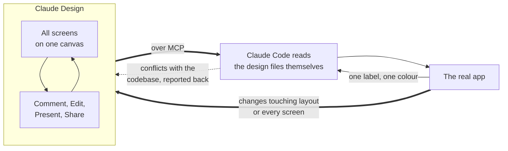

I am not a designer. I am building a fitness app on my own, and it has to be easy to use in a gym, one-handed and between sets. The loop went like this. Describe a screen to Claude Code, get working code back, run it, and only then find out the screen looked wrong, or looked fine and was annoying to use. Every fix meant another prompt, another build, another look. Nothing was broken about that loop. It was just a slow way to answer questions that had nothing to do with code.

{: w="360" h="800" .shadow }
_The app this ended up producing, mid-set. Set 1 logged, Set 2 waiting for numbers, Sets 3 and 4 reading "not yet recorded" rather than sitting blank. The wording on an empty row is not something you get right by describing it._

The usual answer to this is a design tool, and the one everybody names is Figma. It is far deeper than anything I am about to describe, with design systems, real-time collaboration and a plugin ecosystem Claude Design has nothing like. It solves a different problem to mine, though. A Figma screen is a picture of a screen, and somebody still has to turn it into code afterwards. I did not want a better picture. I wanted the screens themselves, early enough that changing my mind was cheap.

Claude Design gives me that. You describe an app, and the screens come back laid out on one canvas: pan, zoom, click into any element, change it. If you have used Figma the canvas will feel familiar. Almost everything else about it works differently.

| | Figma | Claude Design |
|---|---|---|
| What a screen is | A picture of a screen | Live HTML. The inputs take input and the states are real |
| Who can use it | You learn the tool first | You type sentences |
| Getting to code | Dev Mode hands a developer specs and CSS. They rebuild it | Claude Code reads the design over MCP and builds the app |

Figma Make already generates working prototypes from a prompt, so that last row is narrower than it was a year ago. What I have not seen elsewhere is the handoff going straight to the coding agent I already work in.

The reason I tried Claude Design at all is duller than any of that. It comes with the Claude plan I already pay for. Nothing new to buy, nothing new to learn, and Claude Code sitting right next to it.

> **TL;DR**
>
> - **Claude Design renders real screens on a canvas**, not code snippets or mockup images.
> - **Comment pins feedback to an element**, so the fix lands on every page it applies to, not just the one you pointed at.
> - **Edit lets you change things by hand.** Re-prompting to fix one label was always silly.
> - **Present and Share turn the canvas into a review**, including for people who will never open your repo.
> - **The handoff to Claude Code goes over MCP.** The design stays where it is and Claude Code reads it.
> - **What it caught were bugs, not styling.** A cardio exercise asking for kilograms, three headers across four screens, cards that crowd on a phone.
{: .prompt-tip }

What follows is the order I work in: design the screens, fix the UX, hand it over. The middle step is the one I did not expect to matter, and it is where almost everything useful happened.

The fitness app is a good test case, because it is the kind of screen that gets ugly fast: a lot of numbers, a lot of state, and five pages that all have to agree with each other.

## Design: what lands on the canvas

{: w="1911" h="1026" .shadow }
_The Dashboard artboard, one of five pages. Chat on the left, the rendered screen on the right, and the controls that matter in the top right._

The app itself is a small idea. Tell it your age, height, weight and goal, it works out your targets and pushes a plan at you, and tomorrow's plan reacts to what you logged today. The idea is not the interesting part. What happened once I could see it is.

Three things in that screenshot are worth pointing out.

**The screen on the right is real.** Those set rows accept input. The "How is this calculated?" line expands. Set 1 is in a logged state, Set 2 is mid-entry, Sets 3 and 4 are empty. That is one artboard showing three states at once, which is exactly the thing you cannot check by reading a description of it.

**The title bar says 5 pages.** Four screens, Dashboard, Log, History and Settings, plus the signed-out state, all sitting on the same canvas. Consistency stops being something you promise yourself and becomes something you can see.

**The chat panel is still there.** Claude Design does not replace prompting. It gives the prompting somewhere to land.

### The four controls

| Control | What it is for | When I reach for it |
|---------|----------------|---------------------|
| **Comment** | Pin a note to a specific element on the screen | The fix is a judgement call, and probably applies to four other screens too |
| **Edit** | Click into the design and change it directly | I typed the wrong word, or a number is off |
| **Present** | Step through the pages the way a user would | Checking the flow rather than any single screen |
| **Share** | Send a link to someone else | I want an opinion before I build any of it |

Comment and Edit split the work better than I expected. Commenting is how you get consistency: point at one empty state, say what is wrong with it, and the same correction lands on the Log page and the History page you had already forgotten about. Editing is for when the round trip is not worth it. Changing "Feedings" to "Meals" does not need a model.

Share is the one that changes the project's shape. A design link is something a non-technical person can react to in ten seconds. A GitHub repo is not.

## UX: the things you only catch by using it

I expected to spend my time on layout. Almost everything I actually found was a bug. Four worth naming, and none of them are specific to a fitness app.

**A cardio row asking for kilograms.** The Incline Treadmill Walk had kg, reps and reps-left inputs, because it sat in a list of weighted lifts and quietly inherited their shape. You cannot log a fifteen minute walk in kg. It became minutes plus optional steps. That is a data model bug, caught by looking at a screen.

**Four screens, three different headers.** Dashboard had icon and text navigation with a hamburger below 720px. Log and History had text-only navigation, no hamburger and no sign-out. Apps grow this way, one screen at a time, and nobody notices until the screens are side by side. Dashboard's pattern won and the other three were made to match it.

**A page that jumped when you moved between screens.** The content width was different on different pages, so navigating shifted everything sideways. Nothing about that shows up in a description or a single screenshot. You catch it by clicking from one screen to the next. One width everywhere and it was gone.

**Cards that crowded on a phone.** History and Log used fixed padding. Dashboard used padding that scales with the screen. Side by side on a desktop canvas they look identical, and at phone width two of them start squeezing their contents while the third breathes. Every card scales now. Nothing in the description of those screens was wrong, which is exactly why a prompt would never have caught it.

## Handover: giving it to Claude Code

The design does not stay a design.



_The loop on the left is where the thinking happens. What crosses into code carries the design itself rather than a picture of it, and changes come back to the canvas whenever they affect more than one screen._

The handoff is a prompt, not an export. Claude Design leaves three kinds of file behind: a spec that describes how the app should behave, a README, and the screens themselves as HTML. Claude Code reads all three over MCP, straight from where they sit, so nothing gets flattened into a screenshot on the way.

What it does with them depends almost entirely on how you ask. The prompt I send is about this long:

```text
Read the spec first, then the README, then the screens in /design.
The rendered HTML is a reference to recreate, not code to copy.
Do the cross-screen rules first (one header, one content width,
cards that scale), then the per-page changes.
Tell me anywhere this conflicts with the code that already exists.
```

Two of those lines are there because of what happened without them.

**The HTML is a reference, not a starting point.** Those files were written to look right on a canvas, not to be a codebase. Without that sentence I got the design's markup lifted straight into the app: its class names, its inline styles, its nesting. With it, I got my own components that happen to match the design.

**Sweeping rules first, single pages after.** "Every header behaves the same way" touches four screens. "The Log page needs a date picker" touches one. Ask for both in one breath and the small specific one gets done while the sweeping one gets half done, because it is easier to finish.

> Check you are handing over the current files. Mine still held pre-fix copies of the screens, and Claude Code would have rebuilt every bug I had just spent the morning removing. When the design is the spec, a stale design is a stale build.
{: .prompt-warning }

Then the app exists, and you want to change something. That splits in two. Anything touching layout, or anything every screen has to share, goes back to the canvas first, because seeing all the screens together is the entire point and you lose it the moment you start patching them one at a time in code. One label or one colour goes straight into the code. Routing a single word through the canvas and a handoff costs more than the fix is worth.

## The honest caveats

**It will render a bad idea beautifully.** Everything useful I got came from looking at the result and having an opinion. The opinion is still yours to supply.

**A rendered screen is not a working app.** Nothing on my canvas talks to a database. That workout plan looks plausible, but no code worked it out from my actual weight. The design tells you what to build, not whether it works.

**Small jobs are not worth the detour.** For one screen, prompting Claude Code directly is still faster. It starts paying off at four or five screens, when they have to agree with each other.

## Worth it?

Yes, and not for the reason I expected. I thought I was buying a faster way to produce UI. What I got was a place to notice things.

The prompt is where you say what you want. The canvas is where you find out what you actually meant.
