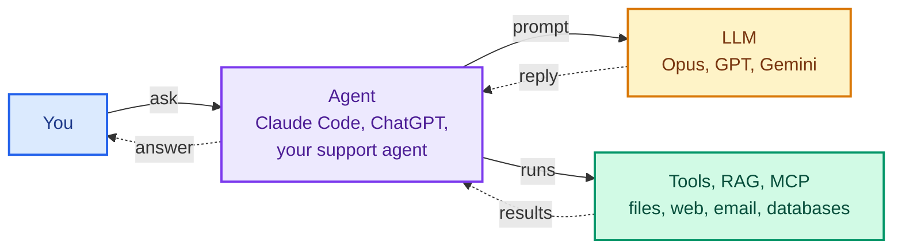
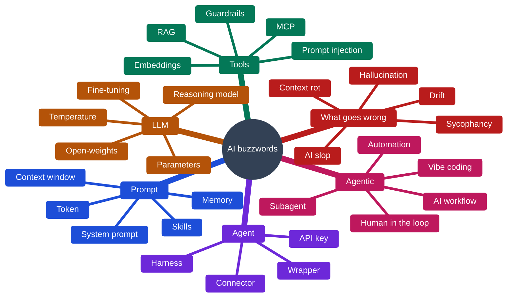

Picture a meeting. Someone says, "Let's make it agentic." Someone else adds, "It has to be deterministic," and a third says, "Just use RAG." Everyone nods. Nobody asks what any of it would actually change, because nobody wants to be the one who asks.

Most of us picked these words up from a few videos and posts: enough to repeat them, not enough to explain them. I include myself in that.

So do not fake it till you make it. Understand it, so you actually make it.

This page is my fix. Over seventy terms, each explained in a line or two, and grouped by where they sit in one simple picture of how AI apps work. Keep it open in your next meeting.

> **TL;DR**
>
> - **Claude Code is not Opus, and Copilot is not GPT.** Almost every AI product has the same three parts: the agent (the software that does the work), the LLM (the model it calls), and the tools the agent uses. The prompt is what the agent sends to the LLM.
> - **Automation is not the same as an agent.** Automation follows fixed steps a person wrote. An agent lets the LLM choose the next step. Adding an LLM to automation does not turn it into an agent.
> - **The LLM cannot do anything by itself.** It only reads what it is sent and writes a reply. RAG, MCP and every other tool belong to the agent.
> - **Short on time?** Jump to [what goes wrong, and how to fix it](#the-answer-what-comes-out-and-what-goes-wrong). It is the most useful part of this page.
{: .prompt-tip }

Here is the picture. You ask the agent. The agent sends a prompt to the LLM, runs tools when the LLM asks, and brings the answer back to you.

_Each section below is one part of this picture._

And here is every part at once, with the words that matter most on each branch.

_The whole page on one map. If you only remember the six branches, you can place almost any new word you hear._

## The agent: the software that does the work

_Some agents you chat with, like ChatGPT, Claude Code or Copilot. Others are built for one job, like a support agent, a travel agent or a forex agent, and may run inside another product or in the background with no chat screen at all. Either way, the agent sits between the request and the LLM and does all the work around it._

| What you hear | In plain words |
|---|---|
| AI agent | An LLM given a job, instructions and tools, running in a loop until the job is done. Claude Code and Copilot are general ones that let you switch the LLM underneath, like Opus to Sonnet or GPT to Claude, while a support or forex agent is built for one job |
| AI assistant, Copilot, chatbot | Names for agents you chat with, often built into another product, like Copilot inside Word. See [GitHub Copilot's two agents](/posts/copilot-agent-mode-vs-coding-agent/) |
| Harness, harness engineering | Everything in the agent except the LLM: its instructions, tools and checks. Harness engineering means improving those instead of switching the LLM |
| Wrapper | An app that adds very little on top of someone else's LLM. "It is just a ChatGPT wrapper" is usually a criticism |
| AI-powered, AI-native | Marketing words. Ask which part actually uses AI, and what it does there |
| Plugin, connector, integration | A way for the agent to reach another service, like your calendar or Google Drive |
| API, API key | How programs talk to each other without a screen, including to an LLM. The key is a password that says who is using it and who pays |

## The prompt: what goes in

_Everything the agent sends to the LLM in one go. It is counted in input tokens, and you pay for every one._

| What you hear | In plain words |
|---|---|
| Prompt | Everything the agent sends to the LLM: its own instructions, the earlier chat, any files, and your message. Not only what you typed |
| Token | The unit text is counted and charged in, about three quarters of an English word. Input tokens are what you send, output tokens are what comes back |
| Context window | How much text fits in one prompt, often just called "context". When a long chat goes past it, older parts get shortened or dropped |
| Context rot | Answers getting worse as the prompt grows, well before the context window is full. Why a fresh chat often beats a long one, and why three relevant files beat a whole codebase |
| System prompt | The agent's own instructions, placed at the top of every prompt, before your message |
| Memory | Notes the agent saves about you and adds to future prompts. The LLM itself remembers nothing. See [the four kinds of memory Claude keeps](/posts/get-more-out-of-claude-memory/) |
| Multimodal | The prompt can include pictures, PDFs and audio, not only text |
| Few-shot, zero-shot | Showing a couple of examples in the prompt so it copies the pattern. Zero-shot means no examples |
| Prompt engineering | Writing your request clearly: what you want, in what format, and what "done" looks like. See [six things I argued about while learning](/posts/six-things-i-argued-about-learning-claude-code/) |
| Context engineering | Choosing everything besides your request that goes into the prompt: which files, rules, tool results and past messages, and what to leave out. In Claude Code, a well-kept CLAUDE.md and a fresh chat for each task are context engineering |
| Custom GPTs, Gems, Projects, Skills | Saved instructions and files, so you do not repeat them in every chat. Skills are added to the prompt only when a task needs them |

## The LLM: the model that reads and replies

_It reads the prompt and writes the reply, one token at a time. It cannot do anything else._

| What you hear | In plain words |
|---|---|
| LLM, model | Large language model, like GPT, Claude or Gemini. It predicts what text comes next. It cannot act on its own and remembers nothing |
| GenAI, generative AI | AI that creates new text, images, audio or code, rather than only sorting or scoring things |
| GPT, transformer | GPT is OpenAI's family of LLMs, short for generative pre-trained transformer. The transformer is the design almost every LLM uses, published by Google researchers in 2017 |
| Foundation model, frontier model | A big general LLM that many apps build on. Frontier means the newest and most capable ones |
| Inference | The LLM actually running on your prompt. This is the part you pay for each time |
| Temperature | A setting for how predictable the wording is. Low gives more predictable answers, high gives more variety. It is an API setting: the chat apps do not show it |
| Deterministic | Same question, same answer, every time. LLMs are not, even at low temperature. The agent's own code can be |
| Reasoning model, chain of thought | An LLM that works through the problem step by step before answering. Slower and costlier, but better at hard problems. Thinking longer adds no actions by itself: it still needs an agent and tools to do anything |
| Routing, SLM | Sending easy requests to a small, cheap LLM (a small language model, like a small Qwen) and hard ones to a big one. See [how I route my own tools](/posts/omniroute-free-tier-routing-and-compression/) |
| Benchmark, leaderboard | Standard tests used to rank LLMs. A high score does not mean it suits your work |
| Evals | Your own test set: 20 to 30 real examples with known good answers, including awkward ones, rerun after every change. Unlike a benchmark, it tells you whether the LLM suits your work |

## How models are made

_Still the LLM box on the picture, but about where a model comes from rather than how you use it._

| What you hear | In plain words |
|---|---|
| Parameters, weights | The billions of numbers inside the LLM, learned during training. "70B" means 70 billion of them |
| Training, knowledge cutoff | The LLM learns by reading a huge amount of text, long before you use it. The cutoff is the date that reading stopped, so it knows nothing newer unless the agent puts it in the prompt |
| RLHF | Reinforcement learning from human feedback: people rate answers, and the model is trained toward the ones they prefer. Part of why chat models sound helpful, and part of why they can be sycophantic |
| Fine-tuning | Training an existing LLM further on your own examples, to change how it behaves. Slow and costly, and it has to be redone when facts change. When people say "train it on our data", they usually need RAG instead |
| Distillation | Training a small model to copy a big one's answers. The small DeepSeek R1 models people run at home were made this way |
| Mixture of experts, MoE | A big model split into many expert parts, with only a few switched on for each token. It is how DeepSeek and Qwen stay large but cheaper to run |
| Quantization | Storing the model's numbers with less precision so it fits on smaller hardware, like a laptop. A little quality traded for a lot less memory |
| Open-weights, open-source model | Open-weights means you can download and run the LLM yourself, like Qwen or DeepSeek, so your prompts never leave your machine (the DeepSeek chat app is different: it sends them to DeepSeek). Open-source would also mean the training data and code, which almost nobody releases |
| Bias | The LLM repeating unfair patterns from the text it learned from |
| AGI | Artificial general intelligence: AI as capable as a person at almost everything. Nobody agrees on exactly what it means or when it will arrive, so treat claims about it as opinion |

## Tools, RAG and MCP: how the agent gets things done

_The LLM cannot touch anything. When it needs a file, your documents or the web, it asks, and the agent does it._

| What you hear | In plain words |
|---|---|
| Tool calling, function calling | The LLM asks the agent to do something, like "read this file", and the agent does it |
| MCP | Model Context Protocol. One standard plug so any tool, like your email, calendar or database, can connect to any agent. A bit like USB: build the tool once, and Claude, ChatGPT and Copilot can all use it |
| MCP server | A small program that offers one tool or data source through MCP, like your Google Drive. It usually calls that system's API underneath, so MCP does not replace an API. See [building your own](/posts/building-mcp-servers-guide/) |
| A2A | Agent2Agent, a protocol for agents to talk to other agents. MCP connects an agent to tools, A2A connects agents to each other |
| RAG | Search first, then answer: the agent pastes the most relevant parts of your documents into the prompt. It is only as good as the search, and a wrong passage comes back as a confident answer with a citation that looks checked |
| Embeddings, semantic search | Text turned into numbers so search can match by meaning, not exact words. A search for "car" can find "vehicle" |
| Vector database | A database built to store those numbers and find the closest matches quickly |
| Chunking, reranking | Cutting documents into small pieces before searching, then re-sorting the results so the best come first |
| Knowledge graph, GraphRAG | Facts stored as things and how they link, like "this customer owns these three accounts". GraphRAG is RAG that can follow those links |
| Grounding, citations | Making the answer rely on the documents in the prompt, and show where each fact came from |
| Computer use, browser agent | The agent clicks and types on a screen or website for you |
| Deep research | The agent runs many web searches, reads the results and writes you a report |
| Guardrails | Checks the agent runs before and after the LLM, to block unsafe or wrong output |
| Prompt injection | Hidden instructions in a web page or file. Once they land in the prompt, the LLM may follow them as if you wrote them |
| Jailbreak | Tricking the LLM into ignoring its safety rules |

## Agentic: when the agent works on its own

_From fixed steps a person wrote, to an agent that keeps going on its own until the job is done._

| What you hear | In plain words |
|---|---|
| Automation | Work that runs by itself on fixed steps: a scheduled report, a script, a Zapier or Power Automate flow. No LLM needed |
| AI workflow | Automation with an LLM doing one step, like reading an email and pulling out the order number. Still fixed steps, so still predictable |
| Agentic, agentic AI, agentic workflow | The LLM decides the next step itself, again and again, like Claude Code choosing which files to open while fixing a bug. It describes how an agent works, not a kind of agent, and jobs with steps you can write down are cheaper and more predictable as an AI workflow |
| Subagent | A helper the agent sends off on a side task, with its own fresh context, reporting back only to the agent that sent it. Mainly for focus: it reads fifty files and returns one summary, so the main chat stays clean |
| Multi-agent | Several agents passing work between each other, like a triage agent handing a case to a refund agent. Some people keep the term agentic AI for this |
| Human in the loop | A person approves before the agent does anything important. It only works if they read what they approve |
| Approval fatigue | Approving so many requests that you stop reading them. The fix is fewer, clearer approvals: let the agent do safe things alone and stop only for risky ones |
| Responsible AI, AI governance | A company's rules for using AI safely and fairly: who can use what, on which data, with which checks |
| Vibe coding | Letting AI write code that you do not read or check |
| Spec-driven development | Writing down exactly what you want first, then letting AI build to match it. See [Spec Kit in practice](/posts/spec-driven-development-with-spec-kit/) |

_A quick check for agentic: Claude answering one question is not agentic. The same Claude running Research, its deep research mode, choosing its own searches until it has an answer, is._

## The answer: what comes out, and what goes wrong

_What the LLM writes back, counted in output tokens, which usually cost more than input tokens. This is also where the problems show up._

| The problem | What people call it | What actually helps |
|---|---|---|
| It makes things up | Hallucination | Put the real source in the prompt (RAG), and check what the search pulled back. Ask it to show where each fact came from. Check every number, name and date |
| It gives a different answer each time | "Not deterministic" | Keep the instructions and examples fixed, and ask for a fixed format, often called structured output. Anything that must be exact, like a calculation, belongs in normal code |
| It is slow | Latency | Use a smaller LLM for easy jobs. Skip reasoning when the task is simple. Send a shorter prompt. Stream the answer, showing it word by word, so the wait feels shorter |
| It costs too much | Token cost | Shorter prompts, smaller LLMs for easy work, caching (reusing work already paid for), and fewer rounds when it works on its own. [Keep the cost on screen](/posts/claude-code-custom-statusline/) so you notice |
| It works in the demo, then fails on real, messy input | "Not robust" | Build evals and rerun them after every change. Decide what happens when it fails: retry, fall back, or hand it to a person |
| It loses track in a long chat | Context rot | Start a fresh chat for a new task. Put facts it always needs into its instructions or memory. Do not wait for the context window to fill: quality drops long before |
| It does not know recent things | Knowledge cutoff | Give it current sources, or let it search the web |
| It agrees with whatever you say | Sycophancy | Do not hint at the answer you want. Ask it to argue against your idea |
| It follows instructions hidden in a page or file | Prompt injection | Give it only the access it needs. Make it ask before it sends, deletes or pays for anything, and read the request before you approve |
| It wanders off on long tasks | Drift | Write down what "done" looks like first. Break the work into small steps, with a check in between |
| It produces confident, empty text | AI slop | A person reads it before it goes out. Every time |

**If you do only one thing, keep evals.** That habit catches more of the problems above than any clever prompt.

## The pattern behind all of this

Strip away the brand names and every word here sits on one box of that first picture: the agent, the prompt, the LLM, the tools, or what comes back.

If someone uses a word that is not on this page, ask them where it sits on the picture. If they cannot say, it is probably a new name for something already here.

The words will keep changing. The picture will not.
