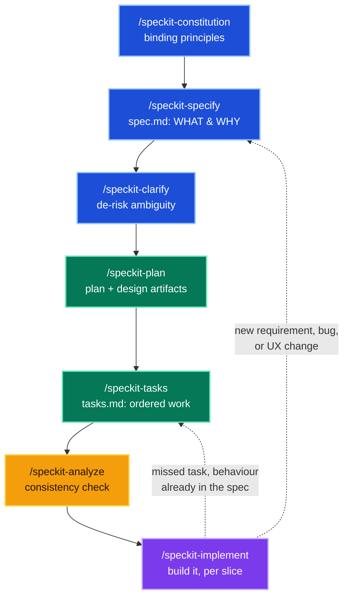

If you've used an AI coding agent on anything beyond a toy, you know the failure mode. You describe what you want, it starts writing code, and three prompts later it's confidently building the wrong thing. Not because the model is dumb, but because there was never a shared, written definition of *right* to work against. The agent optimizes for "produce plausible code now," and you find out about the mismatch after it's already sunk an hour into it.

**Spec-driven development** is the corrective. Instead of prompting your way straight into code, you first produce a small stack of durable artifacts: principles, a specification, a plan, a task list. Those become the source of truth the agent works against, and the code is generated last, from documents you've already reviewed. It's the same instinct behind writing a design doc before a big change, except here the documents aren't just for humans; they're what the agent actually builds from.

[GitHub's **Spec Kit**](https://github.com/github/spec-kit) is a toolkit that makes this concrete. It gives you a CLI, a set of templates, and a pipeline of commands that walk you from a rough idea to an executable task list, then to code. This post is a practical guide to running that pipeline: how to install it, what each command does, what to review at each step, what to do when the project keeps moving afterwards, and where the process is worth the overhead. Nothing here is tied to a particular stack or project size. The same pipeline runs on a single service and on a system made of several. I've used this at work to build real systems, not just a demo repo. Now that agents write most of the code, the process around them is what decides whether the result holds together.

> **TL;DR**
>
> - AI agents drift. Without a written spec, the only record of your decisions is the chat and the code, and both go stale.
> - Spec Kit gives you a pipeline: **constitution → specify → clarify → plan → tasks → analyze → implement**. Each command produces a document you review before generating the next one.
> - Install with `uv tool install specify-cli`, then `specify init --here --integration claude`. Start Claude Code from the project folder or the commands won't register.
> - The **constitution** is the part that keeps paying. Write four to six testable principles once; every later stage checks against them.
> - Don't skip **analyze**. It's the only step that reads all four documents together and asks whether they still agree. Nothing else can catch a contradiction *between* documents, because everything else is generated from them.
> - **Implement one story at a time**, not the whole task list.
> - The pipeline **doesn't end at implement**. New requirements, bugs and UI changes go back through the documents first. That habit is the actual discipline; no tool enforces it for you.
> - Skip all of this for a throwaway script. Use it when the code has to stay coherent across many files and more than one repo.

## How it differs from vibe coding

"Vibe coding" is the natural way most people use an AI agent: you describe what you want in chat and let it write code immediately, steering with follow-up prompts. It's fast and it's genuinely great for small, throwaway work. It falls apart when the thing has to hold together, because the only record of what you decided lives in a scrolling chat and in the code itself, and both drift.

Spec-driven development flips the order. You write the decisions down first, review them, and only then let the agent generate code from them. Put another way, it moves your decisions out of the agent's short-term context, where they drift, and into a durable *memory* it can't lose track of, which is the shift I unpack in [the four kinds of memory Claude runs on](https://arunendapally.com/posts/get-more-out-of-claude-memory/). Here's the contrast at a glance:

| | Vibe coding | Spec-driven development |
|---|---|---|
| **How you start** | Prompt straight into code | Write principles and a spec first |
| **Source of truth** | The chat and the code | Reviewed documents the agent builds from |
| **When code appears** | Immediately | Last, after the plan is agreed |
| **Where you catch mistakes** | In the running code, after the fact | In plain-text docs, before any code exists |
| **Best for** | Quick spikes, throwaway scripts | Work that must stay coherent across many files |

Neither is "better" in the abstract; they fail in different places. Vibe coding fails slowly, on work that has to stay coherent. The rest of this post is about the other option, and the tooling that makes it practical.

## Installing Spec Kit

Spec Kit ships as a Python CLI called `specify`. The recommended route is [`uv`](https://github.com/astral-sh/uv), installing the published package:

```powershell
uv tool install specify-cli
```

If you'd rather not add another package manager just to try a tool, you can install straight from the repo with pip:

```powershell
pip install git+https://github.com/github/spec-kit.git
```

That second form tracks `main` rather than a tagged release, so you may land on something mid-flight. On the `uv` install, `specify self upgrade` keeps you current.

One Windows gotcha: pip may drop `specify.exe` into a per-user Scripts directory that isn't on your PATH. The install "succeeds" but the command doesn't exist in a new shell. Add that Scripts directory to your PATH and it works. If `specify` reports "command not found" right after a clean install, that's almost certainly the cause.

Then initialize a project. You can run it in place if the folder already holds notes, and you tell it which agent and script flavour to target:

```powershell
specify init --here --integration claude --script ps --force
```

That scaffolds a `.specify/` directory (templates, scripts, and a `memory/` folder for the constitution) and installs the workflow as a set of Claude Code skills: `speckit-specify`, `speckit-plan`, and so on. From here, the work is the pipeline, not ad-hoc coding.

One practical note before you start: those `/speckit-*` commands are installed as project-scoped skills, so they only auto-register when Claude Code launches from the project directory. Start your session elsewhere and they read as "unknown command." Start in the project folder.

## The pipeline

Spec Kit's flow is a sequence of commands, each consuming the previous stage's output and producing the next artifact:

_[Rendered diagram in the original post](https://arunendapally.com/posts/spec-driven-development-with-spec-kit/)._



Colour tracks the kind of work: **blue** stages define what you're building, **green** stages design how, **amber** is the read-only consistency check, and **purple** is where code finally gets written. Note the two dashed edges coming back off implement: the short one for work the spec already covers, the long one for everything else. Those loops are most of the actual life of a project, and I'll come back to them.

The whole method rests on one habit: you review each artifact *before* generating the next. You're never more than one stage away from catching a wrong turn, and every stage after the constitution is checked back against it. Here's how to run each step and what to look for.

## Step 1: Establish the constitution

Run `/speckit-constitution` first. It produces `constitution.md`, a short list of engineering principles that hold for *this* project. Think of it as the rules you never want silently violated: architectural boundaries, data invariants, security posture, a simplicity stance.

Keep it short and make each principle testable. "Write clean code" is a slogan. A good principle is narrow enough that a later stage can check it: *no service reads another service's database directly*; *writes are append-only, so a correction is a new row and never an overwrite*; *every public endpoint ships versioned from day one*. The test is whether you could point at a design decision and say unambiguously that it breaks the rule.

Why bother writing these down? Because later stages treat them as **gates**. The plan runs an explicit "Constitution Check," and the analyze stage flags any violation as a critical finding. That's what separates a constitution from a README full of good intentions.

## Step 2: Specify the WHAT, not the HOW

`/speckit-specify` turns a natural-language description into `spec.md`. The discipline it enforces is **staying technology-agnostic**: the spec is about user value and behaviour, with no framework, database, or language named. That comes later, on purpose.

The template pushes you toward **prioritized user stories**, each independently testable. The most useful move here is to order them so the first story is a viable MVP on its own. That priority ordering isn't decoration; it carries all the way to the task list, and it's what lets you later build and ship one slice at a time.

Write your **success criteria as measurable outcomes**, not implementation notes. "Submitting the identical entry twice never produces two records" is a criterion you can turn into a test. "Handles duplicates gracefully" is not. Spec Kit generates a quality checklist and validates the spec against it before letting you move on.

## Step 3: Clarify the ambiguities

This is the stage most people underestimate. `/speckit-clarify` scans the spec for genuinely ambiguous decisions and asks a small number of targeted questions, recording each answer back into the spec. It only asks about things that materially change the architecture, data model, or tests; everything else gets a documented default.

How to use it well: answer each question decisively, because each answer becomes a pinned decision the rest of the pipeline honours. These are the small, load-bearing choices a coding agent would otherwise resolve silently and inconsistently, three different ways in three different files. For example, "what counts as a duplicate request?" sounds trivial until the agent has to enforce it; deciding it here (say, a caller-supplied idempotency key) once, in writing, is cheap insurance.

## Step 4: Plan the technical approach

Only at `/speckit-plan` does technology enter the picture. This stage reads the spec and constitution and produces `plan.md` plus a cluster of design artifacts, typically:

- `research.md`: each technology choice with its rationale and the alternatives rejected.
- `data-model.md`: the schema, with your constitution's conventions baked in.
- `contracts/`: the API or tool surface and its input schemas: REST endpoints, event payloads, or [MCP](https://arunendapally.com/posts/building-mcp-servers-guide/) tool definitions, depending on what you're exposing.
- `quickstart.md`: a runnable validation guide mapped to the user stories.

The step to actually read here is the **Constitution Check** the plan runs against every principle. This is where a good constitution pays off: it forces the stack decisions to be traceable to constraints you set earlier, rather than to whatever the model felt like reaching for.

## Step 5: Generate the task list

`/speckit-tasks` converts everything into `tasks.md`: a dependency-ordered checklist, **grouped by user story** so each can be built and tested independently. Setup and foundational work come first (scaffold, schema, migrations, auth), then one phase per story in priority order, then a polish phase.

Two things to look for. First, the **MVP is scoped explicitly** (setup + foundational + your first story), so you know exactly where you can stop and still have something real. Second, any test-first principle from your constitution shows up here as concrete "write the test before the code" tasks for the load-bearing logic. The task list isn't just *what* to build; it encodes *how*.

## Step 6: Analyze for consistency

Before touching code, run `/speckit-analyze`. It's a **read-only** cross-artifact consistency check across the spec, plan, tasks, and constitution. It reports findings and proposes fixes but changes nothing on its own.

Don't skip this one. Your spec, plan, tasks, and constitution get written at different moments, and they drift apart.

Here's the shape it takes:

- `constitution.md`: *writes are append-only; a correction is a new row, never an overwrite*
- `spec.md`: *Story 3: a user can edit a past entry to fix a mistake*
- `data-model.md`: the `entries` table, with an `updated_at` column

One at a time, all three look fine. Together, story 3 plus that column means an `UPDATE`, and the append-only rule you set in week one is gone. Nobody decided to break it. It fell out of three reasonable choices made hours apart.

Nothing downstream catches this. The code compiles. The tests pass too, which is the real problem: they were generated from the same spec, so they encode the same contradiction and confirm the wrong behaviour. You find out months later, when someone asks for the edit history and it isn't there.

Every other check you run descends from these same documents, so a contradiction *between* them is invisible to all of them. Analyze is the only stage that reads all four at once and asks one question: do they still agree? Everything downstream (the plan, the tasks, the code, the tests) is only as coherent as the answer.

If a fix touches a principle you marked non-negotiable, Spec Kit's governance rule makes you bump the constitution's version and record the amendment, so nobody can reinterpret a principle without leaving a record.

## Step 7: Implement one slice at a time

`/speckit-implement` writes the code. The one practice that matters: **build a single slice at a time.** Run it for your MVP (setup + foundational + your first story), verify, then come back for the next story. The task list already marks that boundary, so it's easy to hold.

If the earlier stages did their job, this part is mostly mechanical: every file traces back to a task, and the "how should this actually work?" questions were already answered in specify, clarify, and plan. You'll still hit ordinary bugs, but each one stays small and local because the decisions around it are already settled.

The real payoff is that you can **verify before you provision anything.** Because the logic is built test-first and the interfaces are pinned by the spec, your unit tests, type checks, and build can all pass before there's a database, a deployment, or any live service in the picture. The only checks that stay red are the ones that genuinely need infrastructure, and those wait until you wire it up.

Just be clear on what that proves: the code is internally sound. It builds, its types line up, and its logic is tested. It does *not* prove the system works end to end, which still needs real infrastructure and a run against real data.

You'll also find missed tasks: something the spec clearly requires that never made it into `tasks.md`. Add it and carry on, but add it to the task list, not just to the code. Re-entering at tasks routes you back through analyze, which is what keeps the shortcut honest. And apply the same test from the next section before you take it: if the behaviour is already in the spec, only the task list was incomplete. If it isn't, that's a spec bug in disguise, and the short loop is the wrong tool.

Those are the seven core commands. Spec Kit also ships `/speckit-checklist`, which adds extra quality gates when a project calls for it.

## Step 8: What happens after the first slice

Written out as seven steps, the pipeline reads like something you finish. You don't. `/speckit-implement` is where the first slice ships, and then the actual life of the project starts: the next story is waiting, a requirement changes, a bug turns up in production, someone looks at the screen and says the flow is wrong. That dashed line back to specify is where you'll spend most of your time.

The question from here is no longer "how do I build this." It's **does the spec still describe the system?** Different kinds of change answer that differently.

**A new feature or the next story** is the easy case: it's another pass through the pipeline. Specify the new capability, clarify what's genuinely ambiguous, plan, tasks, implement. The constitution carries over untouched, which is exactly what it's for; principles you set in week one are still gating decisions in month six. Your existing spec is context for the new pass, not something to rewrite.

**A bug** deserves one question before you fix anything: is this a code bug or a spec bug? A code bug is behaviour your spec described and the implementation got wrong. Fix the code, add the test, move on; no pipeline needed. A spec bug is behaviour nobody ever specified, which is *why* nothing caught it. Those need the spec updated first and the code second. Patch the code alone and you've started the drift this method exists to prevent, and you've set up a nasty surprise later, because the next agent run reads the spec as truth and will happily "fix" your patch back out again.

**A UI or UX change** is usually a spec change with no constitutional implication. Reorder the stories or revise the behaviour in `spec.md`, re-run clarify if the change opens real questions, regenerate tasks. Cheap, as long as you make the change in the document rather than straight in the component.

**A constitution amendment** is the rare, heavy one. When a principle turns out to be not merely inconvenient but wrong, bump its version, record the amendment, and re-run `/speckit-analyze` so every existing artifact is re-checked against the new rule. This is the one change that can invalidate decisions you made months ago, which is why it's deliberately awkward.

This is also where Spec Kit is thinnest. The toolkit is strongest on the first pass through a clean problem. Coming back to a codebase that has moved on without its documents is a different job, and it's what `/speckit-converge` exists for: reconciling the pipeline's artifacts with the code as it actually stands. Use it when the two have visibly diverged.

The failure mode here is never dramatic. It's that one Friday someone fixes something directly in the code because it's faster and nobody's looking, and then it happens again, and six weeks later the spec describes a system that no longer exists. At that point you don't have a source of truth any more, you have documentation. Everything the method bought you was in the discipline of routing changes through the documents first, and that discipline is the part no tool enforces for you.

## Where Spec Kit sits

Spec Kit isn't the only way to work like this, and its shape has real consequences. The seven-stage pipeline is heavy by design. That's a good trade on a greenfield feature with real uncertainty and a poor one for a small change to a system that already exists, which is why the overhead complaint usually shows up around the third or fourth change rather than the first.

The closest alternative is **OpenSpec**, which inverts the emphasis. Rather than regenerating a stack of documents per change, it keeps one source-of-truth spec and expresses each change as a delta: what's added, what's modified, what's removed, merged back into the spec when the change is done and archived for history. If most of your work is incremental change to something that already runs, that model fits the shape of the work better. **Kiro** takes a third approach, formalizing requirements in EARS notation so that an ambiguous requirement is closer to a syntax error than a judgement call.

Whichever tool you choose, borrow the EARS-style phrasing. Writing a requirement as `WHEN <trigger> THE SYSTEM SHALL <behaviour>` costs nothing and makes the difference between a requirement you can test and a sentence you can argue about.

## When it's worth it

Here's where the pipeline pays off, and where it doesn't:

- **The artifacts are as much for you as for the agent.** Reading a clean `data-model.md` and a story-ordered `tasks.md` gives you a clearer mental model of your own project than any amount of prompting would. Even if you hand-wrote every line from there, the spec pass pays for itself.
- **Clarify and analyze are the two most underrated steps.** Specify and plan are the obvious value. But clarify forces the small decisions into the open, and analyze catches the drift between them. Those two are where "looks fine" becomes "actually consistent."
- **It's genuinely heavier than vibe coding.** For a throwaway script or a quick one-file experiment, this pipeline is overkill; just prompt the code. It pays off when the thing has to be *coherent*: multiple surfaces, shared contracts, real data, principles that have to hold across dozens of files and more than one repo.
- **The second change is the real test.** Anyone can hold the discipline through the first exciting pass. Whether the spec is still true after the fifth bug fix is what determines if any of this worked.
- **It's only as good as your review.** Analyze catches contradictions *between* documents, not a plausible-but-wrong decision you waved through in the spec. Garbage in, coherent garbage out. The judgement is still yours; what changes is that you're reviewing markdown, where a bad call is cheap to reverse, instead of code, where it isn't.

The honest headline: the planning holds up once you start building. Run properly, every file traces back to a decision someone already reviewed, and analyze, the stage everyone is tempted to skip, catches the drift while it's still a diff between two markdown files.

But the reason to keep doing it isn't the first ship. It's the tenth change. Vibe coding doesn't fail at the start; at the start it feels great. It fails on the slow slide, where every individual prompt is locally reasonable and the system stops resembling anything you'd have agreed to in writing. A spec is what makes that slide visible, because drift shows up as a contradiction between two documents instead of as a defect in production six weeks later.

So the pipeline doesn't end at implement, and neither does the project. New requirements arrive, bugs surface, the UI needs rethinking, and life goes on. The discipline is just that each of those goes through the documents before it goes into the code. You still write the software. You just stop discovering, three days in, that you were building the wrong thing, and you keep not discovering it, release after release.
